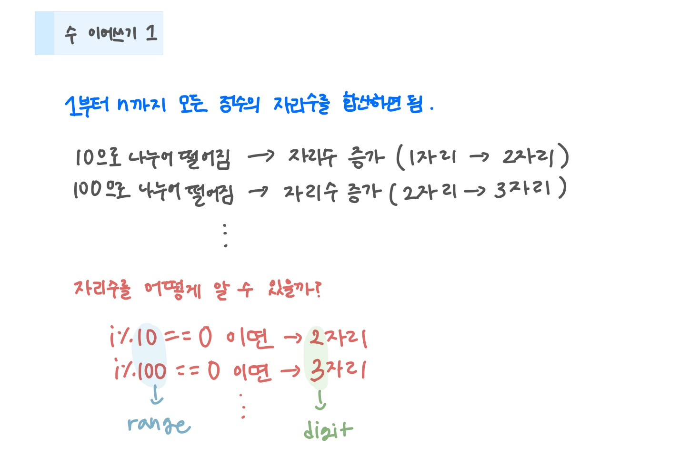

<br>

---

[https://www.acmicpc.net/problem/1748](https://www.acmicpc.net/problem/1748)

---

<br>

# 🔍 문제 풀이

## 문제 도식화

1부터 n까지 각 수의 자리수를 누적하면서, 자리수가 바뀌는 순간(`digit` 증가)과 다음 자리수 기준(`range`) 갱신을 체크하면 된다.



<br>

# 💻 코드

```java
import java.io.*;

public class Main {
    public static void main(String[] args) throws IOException {
        BufferedReader br = new BufferedReader(new InputStreamReader(System.in));

        int n = Integer.parseInt(br.readLine());

        int ans = 0;
        int range = 10; // 자리수 바뀌는 기준
        int digit = 1; // 현재 자리수

        for(int i = 1; i<=n; i++){

            // 자릿수가 변하는 순간
            if(i % range == 0){
                range *= 10; // 다음 자리수 기준 갱신
                digit++; // 자리수 1 증가
            }

            ans += digit;
        }

        System.out.println(ans);


    }
}
```

<br>
