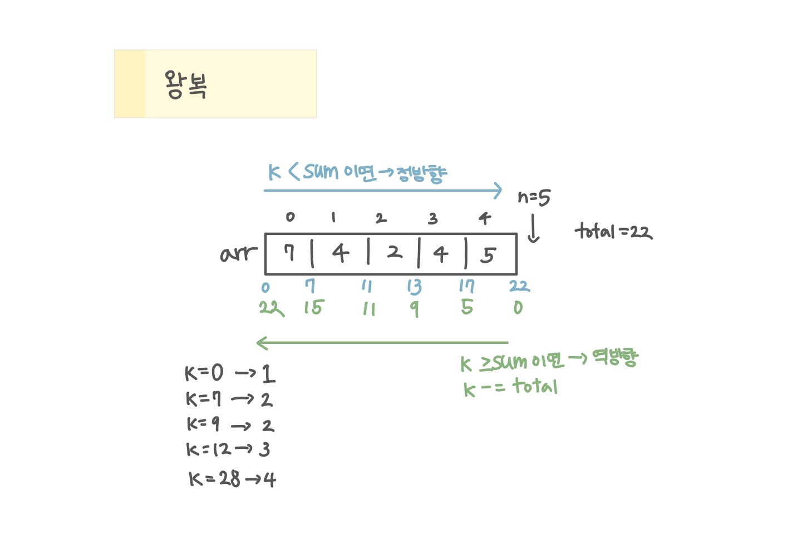

<br>

---

[https://www.acmicpc.net/problem/18311](https://www.acmicpc.net/problem/18311)

---

<br>

# 🔍 문제 풀이

## 문제 도식화



<br>

# 💻 코드

```java
import java.io.*;
import java.util.*;

public class Main {
    public static void main(String[] args) throws IOException {
        BufferedReader br = new BufferedReader(new InputStreamReader(System.in));

        StringTokenizer st = new StringTokenizer(br.readLine());
        int n = Integer.parseInt(st.nextToken());
        long k = Long.parseLong(st.nextToken()); // 자료형 주읨

        int[] arr = new int[n];

        int total = 0;
        st = new StringTokenizer(br.readLine());
        for(int i = 0; i < n; i++){
            arr[i] = Integer.parseInt(st.nextToken());
            total += arr[i];
        }

        int ans = 0;

        if(k < total) {
            int sum = 0;
            for(int i=0; i<n; i++){
                sum += arr[i];
                if(k < sum){
                    ans = i + 1;
                    break;
                }
            }
        }else{
            k -= total;
            int sum = 0;
            for(int i = n-1; i>=0; i--) {
                sum += arr[i];
                if(k < sum) {
                    ans = i + 1;
                    break;
                }

            }
        }

        System.out.println(ans);
    }
}
```

<br>
