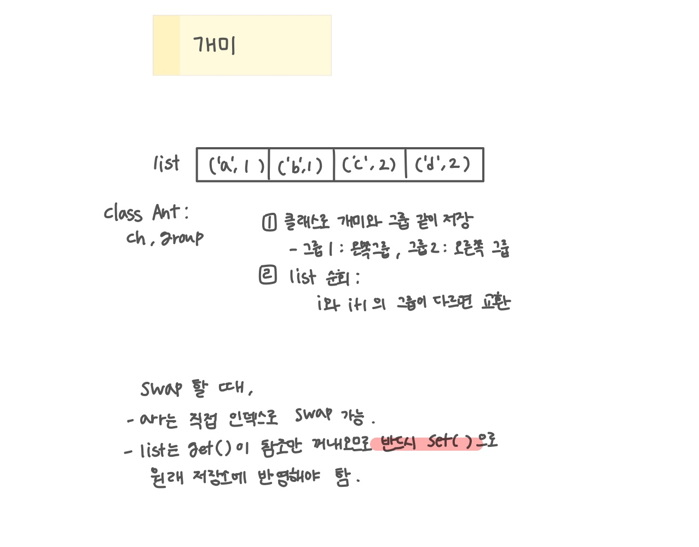

<br>

---

[https://www.acmicpc.net/problem/3048](https://www.acmicpc.net/problem/3048)

---

<br>

# 🔍 문제 풀이

## 문제 도식화

> 방향 배열 사용

- 각 위치에 있는 개미의 방향 정보를 별도의 리스트로 관리
- 초기 개미위치에서 방향이 다른 개미가 만나면 그 위치를 swap



<br>

## 배열 vs 리스트에서 swap 차이

배열이든 리스트든 둘 다 **얕은 복사** 라서 모두 객체 참조를 저장한다.

하지만,

- 배열은 직접 인덱스로 swap이 가능하지만,
- 리스트는 `get()`이 참조만 꺼내오기 때문에, 반드시 set()으로 원래 저장소에 반영해줘야 한다.

<br>

> 배열 (`Ant[] arr`)

```java
Ant temp = arr[i];
arr[i] = arr[i+1];
arr[i+1] = temp;
```

- `arr[i]`와 `arr[i+1]`는 실제 저장소이므로 교환 결과가 곧바로 배열에 반영

<br>

리스트 (`ArrayList<Ant> list`)

```java
// 잘못된 코드
Ant temp = list.get(i);
list.set(i, list.get(i+1));
list.set(i+1, temp);

```

- `get()`은 단순히 참조값을 꺼내서 변수에 복사하는 것 뿐, 리스트 내부에는 영향이 없음
- 리스트는 내부에 있는 배열을 직접 건드릴 수 없기 때문에 반드시 `set()`이 필요하다.

<br>

> 리스트 원소 자체를 바꾸려면 반드시 `set()`을 호출해서 리스트 내부 배열에 들어 있는 참조를 바꿔줘야 한다.

```java
list.set(i, next);
list.set(i+1, cur);
```

- `get(i)` : 리스트 안의 값을 "복사해서 꺼내오기" -> 리스트는 그대로.
- `set(i, 값)` : 리스트 안의 값을 "이 값으로 교체하기" -> 리스트에 실제 변화 발생.
- 그래서 swap하려면 반드시 `set()`을 써야 함

<br>

# 💻 코드

한 턴에서 개미는 최대 1칸만 움직여야 하기 떄문에 `i++`을 통해 방금 swap된 두 개미를 다시 비교하지 않게 해야한다.

```java
import java.io.*;
import java.util.*;

public class Main {
    public static void main(String[] args) throws IOException {
        BufferedReader br = new BufferedReader(new InputStreamReader(System.in));

        StringTokenizer st = new StringTokenizer(br.readLine());
        int n = Integer.parseInt(st.nextToken());
        int m = Integer.parseInt(st.nextToken());

        String ns = br.readLine();
        String ms = br.readLine();

        int time = Integer.parseInt(br.readLine());

        List<Ant> list = new ArrayList<>();

        for(int i=n-1; i>=0; i--) {
            list.add(new Ant(ns.charAt(i), 1));
        }
        for(int i=0; i<m; i++) {
            list.add(new Ant(ms.charAt(i), 2));
        }


        while(time --> 0) {
            for(int i = 0; i < list.size() - 1; i++) {
                Ant cur = list.get(i);
                Ant next = list.get(i + 1);

                if(cur.group == 1 && next.group == 2) {
                    list.set(i, next);
                    list.set(i + 1, cur);

                    // 교환 후 i를 1 증가시켜 다음 쌍 검사를 건너뛰기 (총 2 증가)
                    i ++;
                }
            }
        }

        for(Ant ant : list) {
            System.out.print(ant.ch);
        }


    }

    static class Ant {
        char ch;
        int group;

        Ant(char ch, int group){
            this.ch = ch;
            this.group = group;
        }
    }
}
```

<br>
