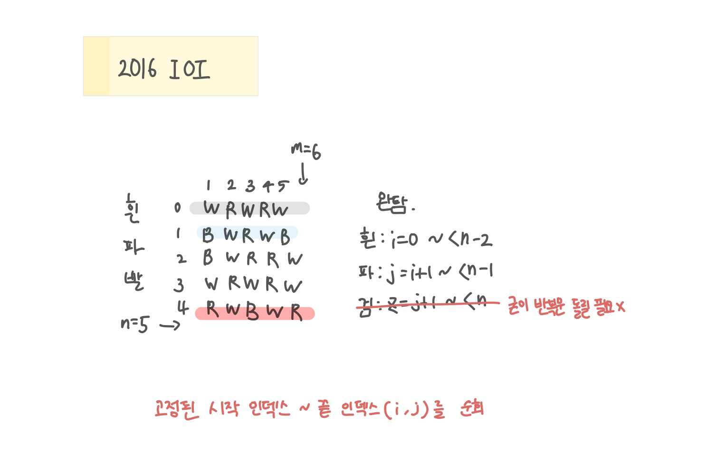

<br>

---

[https://www.acmicpc.net/problem/11950](https://www.acmicpc.net/problem/11950)

---

<br>

# 🔍 문제 풀이

## 문제 도식화

> 정해진 '마지막 인덱스'까지 해당 영역을 순회하는 것이 포인트

- W 띠가 먼저 끝나야 (i 확정), B 띠가 그 다음 줄(i+1)부터 시작할 수 있으므로 중첩반복문 사용
- R은 W 끝과 B 끝이 정해지는 순간, 나머지 영역 전체가 R 띠로 자동 확정되기 때문에 별도의 변수가 필요 X



<br>

# 💻 코드

```java
import java.io.*;
import java.util.*;

public class Main {
    public static void main(String[] args) throws IOException {
        BufferedReader br = new BufferedReader(new InputStreamReader(System.in));

        // input
        StringTokenizer st = new StringTokenizer(br.readLine());
        int n = Integer.parseInt(st.nextToken());
        int m = Integer.parseInt(st.nextToken());
        char[][] arr = new char[n][m];

        for(int i=0; i<n; i++) {
            String line = br.readLine();
            for(int j=0; j<m; j++){
                arr[i][j] = line.charAt(j);
            }
        }

        //solve
        int minChanges = Integer.MAX_VALUE;
        for(int ew = 0; ew <n-2; ew++) { // W 끝
            for(int eb = ew +1; eb <n-1; eb++){ // B끝

                int changes = 0;

                // W
                for(int i = 0; i <= ew; i++){
                    for(int j=0; j < m; j++){
                        if(arr[i][j] != 'W') changes++;
                    }
                }

                // B
                for(int i = ew + 1; i <= eb; i++){
                    for(int j=0; j<m; j++){
                        if(arr[i][j] != 'B') changes++;
                    }
                }

                // R
                for(int i = eb + 1; i < n; i++){
                    for(int j=0; j<m; j++){
                        if(arr[i][j] != 'R') changes++;
                    }
                }

                minChanges = Math.min(minChanges, changes);
            }
        }

        // output
        System.out.println(minChanges);
    }
}
```

<br>
