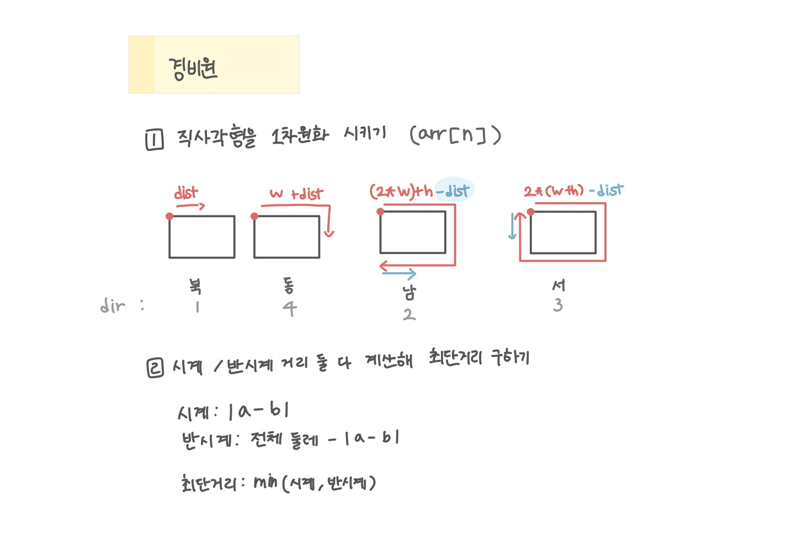

<br>

---

[https://www.acmicpc.net/problem/2564](https://www.acmicpc.net/problem/2564)

---

<br>

# 🔍 문제 풀이

## 문제 도식화

참고한 블로그 : [choppadontbiteme.tistory](https://choppadontbiteme.tistory.com/66#google_vignette)



<br>

# 💻 코드

```java
import java.io.*;
import java.util.*;

public class Main {
    static int w, h;

    public static void main(String[] args) throws IOException {
        BufferedReader br = new BufferedReader(new InputStreamReader(System.in));

        StringTokenizer st = new StringTokenizer(br.readLine());
        w = Integer.parseInt(st.nextToken());
        h = Integer.parseInt(st.nextToken());

        int n = Integer.parseInt(br.readLine());

        int[] arr = new int[n]; // 선형 좌표로 변환 (직사각형 둘레 길이)

        // 상점 좌표 변환
        for (int i = 0; i < n; i++) {
            st = new StringTokenizer(br.readLine());
            int dir = Integer.parseInt(st.nextToken());
            int dist = Integer.parseInt(st.nextToken());

            arr[i] = solve(dir, dist);
        }


        // 경비원(동근이) 좌표 변환
        st = new StringTokenizer(br.readLine());
        int guardDir = Integer.parseInt(st.nextToken());
        int guardDist = Integer.parseInt(st.nextToken());

        int guard = solve(guardDir, guardDist);


        // 시계/반시계 계산해 최단거리구하기
        int ans = 0;

        for (int val : arr) {
            int diff = Math.abs(guard - val); // 시계 방향 거리
            ans += Math.min(diff, 2 * (w + h) - diff); // 반시계 방향 거리와 비교해 더 짧은 것 선택
        }


        // 출력
        System.out.println(ans);
    }

    static int solve(int dir, int dist) {
        if(dir == 1) return dist; // 북
        else if(dir == 2) return (2 * w) + h - dist; // 남
        else if(dir == 3) return 2 * (w + h) - dist; // 서
        else return w + dist; // 동
    }
}
```

<br>
