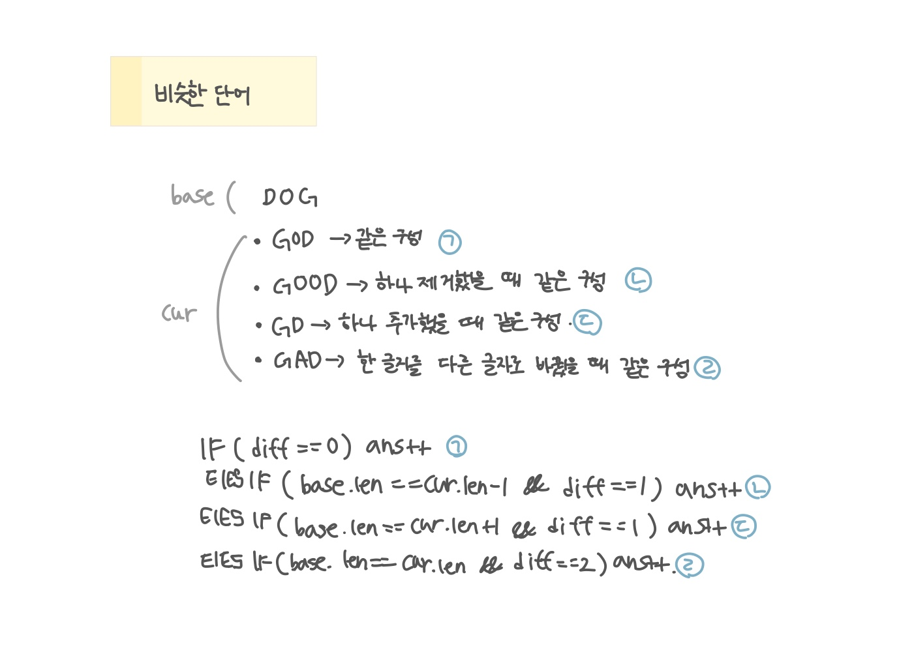

<br>

---

[https://www.acmicpc.net/problem/2607](https://www.acmicpc.net/problem/2607)

---

<br>

# 🔍 문제 풀이

## 문제 도식화



<br>

# 💻 코드

```java
import java.io.*;

public class Main {
    public static void main(String[] args) throws IOException {
        BufferedReader br = new BufferedReader(new InputStreamReader(System.in));

        int n = Integer.parseInt(br.readLine());

        String[] arr = new String[n];

        for(int i=0; i<n; i++) {
            arr[i] = br.readLine();
        }

        int ans = 0;
        for(int i=1; i<n; i++) {
            char[] baseText = arr[0].toCharArray(); // 첫 단어 기준
            char[] curText = arr[i].toCharArray();

            int[] num1 = new int[26];
            int[] num2 = new int[26];

            for(char c : baseText) num1[c - 'A'] ++;
            for(char c : curText) num2[c - 'A'] ++;

            int diff = 0;

            for(int j=0; j<26; j++) if(num1[j] != num2[j]) diff += Math.abs(num1[j] - num2[j]);

            if(diff == 0) ans ++; // 1. 같은 구성
            else if(baseText.length == curText.length - 1 && diff == 1) ans ++; // 2. 한 문자 추가
            else if(baseText.length == curText.length + 1 && diff == 1) ans ++; // 3. 한 문자 삭제
            else if(baseText.length == curText.length && diff == 2) ans++; // 4. 한 문자 교체
        }

        System.out.println(ans);
    }
}
```

<br>
