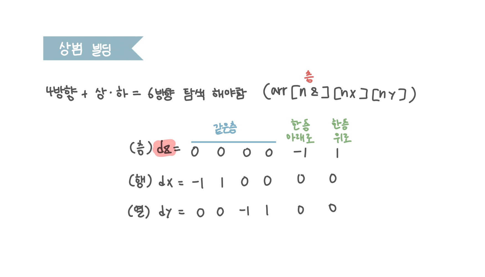

<br>

---

[https://www.acmicpc.net/problem/6593](https://www.acmicpc.net/problem/6593)

---

<br>

# 🔍 문제 풀이

## 문제 도식화

> 상/하를 어떻게 처리할 것이냐가 중점인 문제이다.

- 아래와 상/하는 z 좌표를 `± 1`로 조정해 위층과 아래층으로 이동시키는 방식으로 처리하면 된다.
- [토마토(BOJ 7569)](https://mynamesieun.github.io/algorithm/JAVA-%EB%B0%B1%EC%A4%80-7569%EB%B2%88-%ED%86%A0%EB%A7%88%ED%86%A0/) 번 문제와 굉장히 유사하다.



<br>

# 💻 코드

z만 바꾸면 층 이동, x/y만 바꾸면 같은 층에서 상하좌우 이동

```java
import java.io.*;
import java.util.*;

public class Main {
    static int l, r, c;
    static char[][][] arr;
    static int[][][] v;

   static int[] dz = {-1, 1, 0, 0, 0, 0};
    static int[] dx = {0, 0, -1, 1, 0, 0};
    static int[] dy = {0, 0, 0, 0, -1, 1};

    static Pos start;

    public static void main(String[] args) throws IOException {
        BufferedReader br = new BufferedReader(new InputStreamReader(System.in));

        while(true){
            // input
            StringTokenizer st = new StringTokenizer(br.readLine());
            l = Integer.parseInt(st.nextToken());
            r = Integer.parseInt(st.nextToken());
            c = Integer.parseInt(st.nextToken());

            if(l + r + c == 0) return;

            arr = new char[l][r][c];

            for (int k = 0; k < l; k++) { // 층 인덱스
                for (int i = 0; i < r; i++) {
                    String line = br.readLine();
                    for (int j = 0; j < c; j++) {
                        arr[k][i][j] = line.charAt(j);
                        if (arr[k][i][j] == 'S') {
                            start = new Pos(k, i, j);
                        }
                    }
                }
                br.readLine();
            }

            int ans = bfs();
            if(ans == -1) System.out.println("Trapped!");
            else System.out.printf("Escaped in %d minute(s).\n", ans);
        }
    }

    static int bfs() {
        // 1. 초기화
        Deque<Pos> dq = new ArrayDeque<>();
        v = new int[l][r][c];

        // 2. 초기값
        v[start.z][start.x][start.y] = 1;
        dq.offer(start);

        // 3. 탐색
        while(!dq.isEmpty()) {
            Pos cur = dq.poll();

            // 3-1. 6방향, 범위
            for(int d = 0; d<6; d++){
                int nz = cur.z + dz[d];
                int nx = cur.x + dx[d];
                int ny = cur.y + dy[d];

                if(nz < 0 || nz >= l || nx < 0 || nx >= r || ny < 0 || ny >= c) continue;


                // 3-2. 정답처리
                if(arr[nz][nx][ny] == 'E') {
                    return v[cur.z][cur.x][cur.y];
                }

                // 3-3. 방문가능, 미방문
                if(arr[nz][nx][ny] == '.' && v[nz][nx][ny] == 0){
                    v[nz][nx][ny] = v[cur.z][cur.x][cur.y] + 1;
                    dq.offer(new Pos(nz, nx, ny));
                }
            }
        }

        return -1;
    }

    static class Pos{
        int z, x, y;

        Pos(int z, int x, int y){
            this.z = z;
            this.x = x;
            this.y = y;
        }
    }
}
```

<br>
