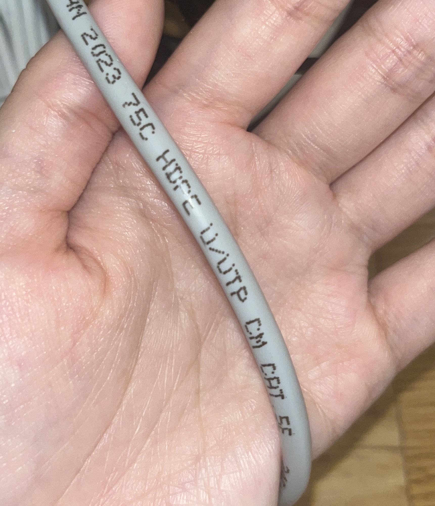

 

---

[[혼자 공부하는 네트워크↗️]](https://www.youtube.com/watch?v=c62qssA4hYI&list=PLYH7OjNUOWLVwdRF6_QmJVR4cQdMp0SU1&index=1)을 바탕으로 정리한 글입니다.
{: .notice--danger}

---

 

# 1. NIC(Network Interface Controller)

## 1.1 NIC란?

> NIC란 호스트를 통신 매체(케이블, 무선 등)에 연결짓는 인터페이스 역할을 하는 장비로, 호스트가 네트워크(LAN)를 통해 다른 장치와 통신할 수 있도록 해준다.

- NIC는 통신 매체 신호와 컴퓨터가 이해하는 정보를 상호 변환한다.
  - 통신 매체에 흐르는 신호(빛,전기 등)를 호스트가 이해할 수 있는 정보로 변환하거나, 호스트가 이해할 수 있는 디지털 기반의 정보를(빛, 전기) 등 다양한 유무선의 통신 매체 신호로 변환할 수 있다.
- 즉, 호스트와 통신 매체의 중간 다리 역할을 하는 네트워크 장비이다.
- NIC만 있으면 네트워크를 이용할 수 있기 때문에 "네트워크를 이용할 수 있게끔 하는 하드웨어"로 널리 알려져있다.

 

> NIC는 다양한 명칭으로 불린다.

- 네트워크 인터페이스 카드
- 네트워크 어댑터
- LAN 카드
- 네트워크 카드
- 이더넷 카드(이더넷 네트워크인 경우)

오늘날의 NIC는 카드 형태가 아닌 USB 연결이 가능하거나 마더보드에 내장된 형태로 제공된다.

 

## 1.2 NIC와 네트워크 인터페이스

> 호스트가 네트워크를 통해 송수신하는 정보는 NIC를 거치게 되므로, NIC는 네트워크 인터페이스(통로)의 역할을 수행한다.

- 네트워크 인터페이스마다 **MAC** 주소를 부여하기 때문에 NIC는 MAC주소를 인식할 수 있다.
- 따라서 NIC는 다음과 같은 기능을 수행한다.

  - 자신과는 관련 없는 수신지 MAC 주소가 명시된 프레임 폐기한다.
  - FCS 필드를 토대로 오류를 검출해 잘못된 프레임을 폐기한다.

    

 

## 1.3 NIC 속도와 성능

> 호스트가 네트워크를 통해 송수신하는 정보는 거의 대부분 NIC를 거치기 때문에 NIC가 정보를 처리하는 성능이 네트워크 송/수신 성능에 큰 영향을 미치게 된다.

- NIC의 지원 속도는 100Mbps부터 100Gbps에 이르기까지 NIC마다 다르다.
- 따라서 내장된 NIC가 있더라도 높은 대역폭에서 많은 트래픽을 감당해야 하는 환경에서는 고속 NIC를 추가하기도 한다.

  

# 2. 케이블(cable)

## 2.1 케이블이란?

> NIC에 연결되는 물리 계층의 유선 통신 매체를 의미한다.

대표적으로 사용되는 케이블은 "트위스티드 페어 케이블", "광섬유 케이블" 이 존재한다.

 

## 2.2 트위스티드 페어 케이블

### 2.2.1 트위스티드 페어 케이블의 형태

> **구리 선**으로 전기 신호를 주고받는 통신 매체를 의미한다.

- 크게 `커넥터+케이블 본체`로 이루어져 있다.
  - 커넥터: 주로 사용되는 커넥터는 `RJ-45`이다.
  - 케이블 본체: 구리 선이 두 가닥(pair)씩 꼬아진(twisted) 형태이다.

> 구리선은 노이즈에 민감하다. 따라서 노이즈를 감쇄시키기 위해 아래와 같은 방식을 사용한다.

\*\*노이즈? 전기적인 신호를 주고받을 때 외부의 신호에 의해 주고받는 신호가 감쇄하거나 훼손되는 상황.

- 차폐(shielding)
  - 구리 선 주변을 감싸 노이즈를 감소시키는 방식
- 브레이드 실드(braided shield) 혹은 포일 실드(foil shield)
  - 차폐에 사용된 그물 모양의 철사와 포일
    

 

### 2.2.2 실드에 따른 트위스티드 페어 케이블의 분류

- STP(Shielded Twisted Pair): 브레이드 실드로 감싼 케이블
- FTP(Foil Twisted Pair): 포일 실드로 노이즈를 감소시킨 케이블
- UTP(Unshielded Twisted Pair): 아무것도 감싸지 않은 구리 선만 있는 케이블

 

> 실드에 따른 트위스티드 페어 케이블은 조금 더 상세하게 분류가 가능하다.

- `XX`에는 케이블 **외부를 감싸는** 실드의 종류(하나 혹은 두 개)
- Y에는 꼬인 **구리 선 쌍을 감싸는** 실드의 종류

 

### 2.2.3 카테고리에 따른 트위스티드 페어 케이블의 분류

> 카테고리가 높을수록 아래와 같은 장점이 존재한다.

1. 지원 가능한 대역폭이 높아짐
2. 송/수신 할 수 있는 데이터의 양이 많아짐
3. 일반적으로 더 빠른 전송이 가능함

 

### 2.2.4 우리 집 케이블 살펴보기🏠

> 실드에 따른 분류: `U/UTP`

케이블 외부에도 실드가 없고 내부에도 실드가 없는 아무것도 감싸지 않는 케이블이구나!..🥹

> 카테고리에 따른 분류: `Cat5`

100Mbps 속도가 나오겠네!

 

## 2.3 광섬유 케이블

### 2.3.1 광섬유 케이블의 형태

> 빛(광신호)을 이용해 정보를 주고받는 케이블을 의미한다.

- 전기 신호를 이용하는 케이블에 비해 속도도 빠르고, 먼 거리까지 전송이 가능하다.
- 노이즈로부터 간섭받는 영향도 적으므로 대륙 간 네트워크 연결에도 사용된다.

 

- 크게 `커넥터+본체`로 이루어져 있다.
  - 사용되는 커넥터 종류가 다양하다.

 

### 2.3.2 광섬유 케이블의 본체 내부

> 광섬유 케이블 본체 내부는 머리카락과 같은 형태의 **광섬유**로 구성되어있다.

- 광섬유는 빛을 운반하는 매체이다.
- 광섬유 중심에는 코어(core)와 코어를 둘러싸는 클래딩(cladding)으로 이루어져 있다.

  - 코어: 광섬유에서 실질적으로 빛이 흐르는 부분
  - 빛이 코어 안에서만 흐르도록 빛을 가두는 역할

  

 

### 2.3.3 코어의 지름 크기에 따른 광섬유 케이블의 분류

> 싱글 모드 광섬유 케이블(SMF, Single Mode Fiber)

- 코어의 지름이 8~10 마이크로미터(µm)

  - (사람의 머리카락 평균두께는 (50~100 µm))

- **코어의 지름이 작으면** 빛의 이동 경로가 하나 이상을 갖기 어렵다. 이를 모드(mode)가 하나(single)라고 표현을 한다.
  - 장점: 신호 손실이 적기에 장거리 전송에 적합하다.
  - 단점: 멀티 모드에 비해 일반적으로 비용이 높다.

 

싱글 모드 광섬유 케이블은 되도록 일직선으로 빛이 이동하기 용이하게 하기 위해, 파장이 긴 **장**파장의 빛을 사용한다.

 

> 멀티 모드 광섬유 케이블(MMF, Multi Mode Fiber)

- 코어의 지름이 50~62 마이크로미터(µm)로 싱글 모드보다 크다.
- 따라서, 빛이 여러 경로로 이동할 수 있다: 모드(mode)가 여러개(multi)
- 멀티 모드는 싱글 모드보다 전송시 신호 손실이 클 수 있기에 싱글 모드에 비해 장거리 전송에는 부적합하다.
- 멀티 모드 케이블은 싱글 모드에 비해 **단**파장의 빛을 사용한다.

 

### 2.3.4 케이블 색상으로 분류하는 싱글모드와 멀티모드

> 케이블 색상으로 싱글 모드를 구분할 수 있다.

- 싱글 모드 광섬유 케이블의 본체: 노란색, 파란색
- 멀티 모드 광섬유 케이블의 본체: 오렌지색, 아쿠아색

 
