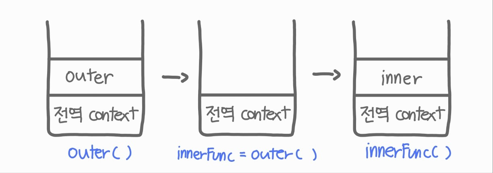

# 1. Closure 개요

## 1.1 Closure 개념

MDN에서는 클로저는 함수와 그 <span style="color:indianred">함수가 선언됐을 때의 렉시컬 환경</span>
(Lexical environment)과의 조합이라고 정의하였다.

즉, 클로저는 반환된 내부함수가 자신이 선언됐을 때의 환경인 스코프를 기억하여 자신이 선언됐을 때의 환경(스코프) 밖에서 호출되어도 그 환경(스코프)에 접근할 수 있는 함수를 말한다.

이를 간단히 말하자면 클로저는 외부 함수의 실행이 끝나더라도 외부 함수 내 변수를 사용할 수 있는 것을 말한다.

<br>

## 1.2 Closure 사용 이유

1. 클로저는 자신이 생성될 때의 환경(Lexical environment)을 기억해야 하므로 메모리 차원에서 손해를 볼 수 있지만, 현재 상태를 기억하고 변경된 최신 상태를 유지하려고 할 떄 유용하게 사용된다.

2. 상태(state)가 의도치 않게 변경되지 않도록 안전하게 은닉(information hiding)하고 특정 함수에게만 상태 변경을 허용하여 상태를 안전하게 변경하고 유지하기 위해 사용한다.

3. 전역 변수의 사용을 억제하기 위해 사용된다.

<br>

# 2 Closure 예제

## 2.1 렉시컬 스코프

`console.log(x)`가 어떤 값을 출력하게 될지 예상해보자

```js
const x = 1;

function outerFunc() {
  // x는 함수가 선언된 렉시컬 환경을 참조한다.
  // 렉시컬 환경은 함수가 선언된 시점을 나타낸다.
  // 즉, 함수가 선언될 당시의 외부 변수 등의 정보를 참조하는 것이다.
  const x = 10;
  function innerFunc() {
    console.log(x); // 10
  }

  innerFunc();
}

outerFunc();
```

① `innerFunc()` 내부의 `console.log(x)`에서 참조하고 있는 x 값은 먼저 스코프 내부에서 x 값을 찾는다.

② 위 코드와 같이 x의 값이 없는 경우 scope chain에 의해 바로 바깥쪽 scope를 찾는다. (즉, outer를 찾는 것이다.)

③ outer는 해당 실행컨텍스트의 생성시점의 LexicalEnvironment를 갖고 있다.

④ 그래서 10에 먼저 접근하고, `console.log(x)는 10`이 출력되는 것이다.

<br>

`console.log(x)`가 어떤 값을 출력하게 될지 예상해보자

```js
const x = 1;
function outerFunc() {
  const x = 10;
  // 상위 스코프는 함수 정의 환경(위치)에 따라 결정된다.
  // 함수 호출 위치와 상위 스코프는 아무런 관계가 없다.
  innerFunc(); // 1
}

// 함수 innerFunc는 자신의 상위 스코프, 즉 전역 렉시컬 환경을 저장하여 기억한다.
function innerFunc() {
  console.log(x); // 1
}

outerFunc();
```

① `outerFunc()`내에서 `innerFunc()`를 호출하였다.

② 하지만, `outerFunc()`와 `innerFunc()`는 다른 스코프를 가지고 있다.

③ 따라서 `innerFunc()`에서는 `outerFunc()`의 x에 접근할 수 없으므로 1이 출력되었다.

④ ⭐ 즉, JS 엔진은 함수를 어디서 <span style="color:indianred">"호출"</span> 했는지가 아니라, 어디에 <span style="color:indianred">"정의"</span> 했는지에 따라서 상위 스코프를 결정하는데, 이를 렉시컬 스코프(lexical scope)라고 한다.

⑤ 즉 외부 렉시컬 환경에 대한 참조값인 outer는 함수 정의가 평가되는 시점에 결정되는 것이다.

<br>

## 2.2 Closure와 렉시컬 환경

외부 함수보다 중접 함수가 더 오래 유지되는 경우, 중첩 함수는 이미 생명 주기가 종료한 외부 함수의 변수를 <span style="color:indianred">여전히</span> 참조할 수 있다.

"중첩함수 + 종료 + 여전히"를 조합한 이 개념이 바로 클로저이다.

```js
const x = 1;

// 1
function outer() {
  const x = 10;
  const inner = function () {
    console.log(x);
  };
  return inner;
}

const innerFunc = outer();
innerFunc();
```

<br>

① 위 코드의 콜 스택을 그려보자



② `outer()` 함수를 호출하면 중첩 함수 `inner`를 반환(return)한다.

③ 그리고 `outer()` 함수의 실행 컨텍스트는 실행 컨텍스트 스택에서 pop되어 제거된다.
(innerFunc에 값을 전달하는 역할을 완료했으므로)

④ innerFunc는 outer 함수의 렉시컬환경을 <span style="color:indianred">여전히</span> 참조하고 있다.

⑤ 즉, outer 함수의 실행 컨텍스트는 실행 컨텍스트 스택에서 제거되지만 outer 함수의 렉시컬 환경까지 소멸하는 것은 아니라는 것을 확인할 수 있다.

⑥ 정리하자면 inner 함수가 outer 함수보다 오래 유지됐고, 종료한 outer 함수의 변수였던 `x=10`을 여전히 참조하였다. → 이를 클로저라고 한다.

<br>

## 2.3 Closure의 구분

1. 상위 스코프의 식별자를 참조하지 않기 때문에 클로저라고 하지 않는다.

   ```js
   function foo() {
     const x = 1;
     const y = 2;

     function bar() {
       const z = 3;

       // 상위 스코프의 식별자를 참조하지 않는다.
       console.log(z);
     }

     return bar;
   }

   const bar = foo();
   bar();
   ```

   <br>

2. 상위 스코프의 식별자를 참조하지만, bar 함수는 외부로 나가서 따로 호출되는게 아니라, 선언 후 바로 실행되고 소멸하기 때문에 클로저라고 하지 않는다.

   ```js
   function foo() {
     const x = 1;

     function bar() {
       debugger;
       // 상위 스코프의 식별자를 참조한다.
       console.log(x);
     }
     bar();
   }

   foo();
   ```

   <br>

3. 상위 스코프의 식별자를 참조하며 중첩 함수 bar는 외부 함수보다 더 오래 유지되기 때문에 클로저이다.

   ```js
   function foo() {
     const x = 1;
     const y = 2;

     // 상위 스코프의 식별자를 참조한다.
     function bar() {
       debugger;
       console.log(x);
     }
     return bar;
   }

   const bar = foo();
   bar();
   ```

<br><br>

# 3 Closure 활용

## 3.1 Closure 활용 예제

1. 카운트 상태 변경 함수 #1 : 클로저 활용 x

   ```js
   // 함수가 호출될 때마다 호출된 횟수를 누적하여 출력하는 카운터를 구현한다.
   // 카운트 상태 변수
   let num = 0;

   // 카운트 상태 변경 함수
   const increase = function () {
     // 카운트 상태를 1만큼 증가시킨다.
     return ++num;
   };

   console.log(increase()); // 1
   // num = 100;
   console.log(increase()); // 2
   console.log(increase()); // 3
   ```

   ① 위 코드의 변수 `num`은 은닉되지 않았기 때문에 `num = 100;`과 같이 외부에서 카운트 상태(num 변수의 값)를 변경할 수 있다는 단점이 존재한다.

   ② 따라서 카운트 상태(num 변수의 값)는 increase 함수만이 변경할 수 있어야 한다.

   <br>

2. 카운트 상태 변경 함수 #2 : 클로저 활용 x, 전역변수 `num`을 지역변수로 변경

   ```js
   const increase = function () {
     // 카운트 상태 변수
     let num = 0;

     // 카운트 상태를 1만큼 증가시킨다.
     return ++num;
   };

   // 이전 상태값을 유지 못함
   console.log(increase()); // 1
   console.log(increase()); // 1
   console.log(increase()); // 1
   ```

   ① `num` 변수는 `increase` 함수의 지역변수로 선언됐기 때문에 의도치 않는 변경은 방지됐다.

   ② 하지만, `increase()`가 호출될 때마다 num이 초기화된다.

   ③ 따라서 의도치 않은 변경은 방지하면서, 이전 상태를 유지해야 한다.

   <br>

3. 카운트 상태 변경 함수 #3 : 클로저 활용 o

   ```js
   const increase = (function () {
     // 카운트 상태 변수
     let num = 0;

     // 클로저
     return function () {
       return ++num;
     };
   })(); // () : 즉시 실행 함수, 클로저에 자주 사용되는 형태

   // 이전 상태값을 유지
   console.log(increase()); //1
   console.log(increase()); //2
   console.log(increase()); //3
   ```

   ① 위 코드가 실행되면, "즉시 실행 함수"가 호출되고 함수가 반환(inner)되고 반환된 함수는 `increase` 변수에 할당된다.

   ② `increase` 변수에 할당된 함수는 자신이 정의된 위치에 의해 결정된 상위 스코프인 즉시 실행 함수의 "렉시컬 환경"을 기억하는 클로저다. 즉, `let num = 0`을 기억하는 것이다.

   ③ 즉시 실행 함수는 호출된 이후 즉시 소멸(stack pop)되지만, 즉시 실행 함수가 반환한 클로저는 `increase` 변수에 할당되어 호출된다.

   ④ 이때 즉시 실행 함수가 반환한 클로저는 자신이 정의된 위치에 의해 결정된 상위 스코프인 즉시 실행 함수의 렉시컬 환경을 기억하고 있다.

   ⑤ 따라서 즉시 실행 함수가 반환한 클로저는 카운트 상태를 유지하기 위한 자유 변수 `num`을 언제 어디서 호출하든지 참조하고 변경할 수 있다.

   ⑥ `num`은 초기화 되지 않았으며, 외부에서 직접 접근할 수 없는 은닉된 값을 갖게 되어 의도되지 않는 변경도 걱정할 필요가 없다. `increase` 변수에서만 변경할 수 있기 때문이다.

    <br>

   → 즉, 클로저는 상태(state)가 의도치 않게 변경되지 않도록 안전하게 은닉(information hiding)하고 특정 함수에게만 상태 변경을 허용하여 상태를 안전하게 변경하고 유지하기 위해 사용한다!
