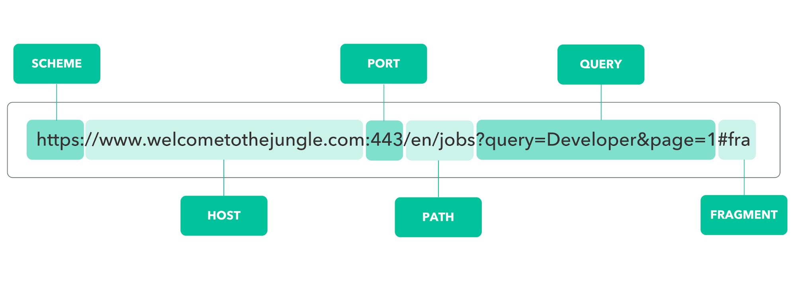

<br>

# 1. URL의 구성 요소

URL은 다음과 같이 이루어져있다.<br>
이번 포스팅에서는 Query string에 대해 세부적으로 다뤄 볼 것이다.


[[이미지 출처]](https://www.welcometothejungle.com/en/articles/btc-url-internet)

| 구성 요소        | 예제                | 설명                                                                            |
| ---------------- | ------------------- | ------------------------------------------------------------------------------- |
| Protocol(Schema) | `https://`          | 통신에 사용되는 프로토콜을 나타낸다. 일반적으로 "http" 또는 "https"를 사용한다. |
| Domain(Host)     | `www.example.com`   | 서버의 도메인 이름이나 IP 주소를 나타낸다.                                      |
| Port             | `:8080`             | 서버에 연결할 때 사용되는 포트 번호를 나타낸다. 기본값은 80이다.                |
| 경로             | `/path/to/resource` | 서버에서 원하는 리소스의 경로를 나타낸다.                                       |
| Query string     | `?name=John&age=25` | 추가적인 매개변수와 값을 전달하는 데 사용된다.                                  |
| Fragment         | `#section1`         | 문서 내의 특정 섹션이나 위치를 가리키는 데 사용된다.                            |

<br><br>

# 2. Query string 개요

## 2.1 Query String 개념

① 사용자가 입력 데이터를 전달하는 방법중의 하나로, url 주소에 미리 협의된 데이터를 파라미터를 통해 넘기는 것을 말한다.

② query parameters( 물음표 뒤에 = 로 연결된 key value pair 부분)을 url 뒤에 덧붙여서 추가적인 정보를 서버 측에 전달하며 클라이언트가 어떤 특정 리소스에 접근하고 싶어하는지 정보를 담는다.

③ 웹 서버는 이를 이용하여 페이지의 내용을 사용자가 요청한 정보에 따라 변경하는 등의 작업을 수행한다.

<br>

## 2.2 Query String 구조

① Query string은 URL의 '?' 문자 뒤에 위치한다.<br>`https://example.com/over/there?name=ferret`

② parameter = value로 필요한 파라미터의 값을 적는다

③ 여러 개의 key-value pair을 포함할 수 있으며, '&' 문자로 구분한다. <br>`https://example.com/path/to/page?name=ferret&color=purple`

④ 각 key-value pair은 '='으로 key와 value를 구분한다.<br>`http://example.com/page?name=kori&age=8`<br>↑ 서버에 'name' key의 값으로 'kori', 'age' key의 값으로 '8'을 전달하는 것을 의미한다.

<br><br>

# 3. js에서 Query string 파싱하기

## 3.1 Query string 파싱이 필요한 이유

Query string은 사용자의 요청이나 특정 상황에 따라 웹 페이지의 내용을 동적으로 바꾸는 데 사용한다.

예를 들어, 사용자가 특정 항목을 클릭하면 해당 항목의 상세 정보를 보여주는 페이지로 이동할 때, 항목의 ID를 쿼리 스트링으로 전달하여 해당 ID를 기반으로 상세 정보를 불러올 수 있다.

JavaScript에서 제공하는 URLSearchParams 인터페이스를 사용하면 split()등을 활용하지 않기 때문에 쉽게 처리할 수 있다.

<br>

## 3.2 URLSearchParams 객체 생성 방법

① URL 객체의 search 프로퍼티를 이용한 생성

- 위의 코드와 같이 직접 URL 객체를 만들어서 URLSearchParams 객체를 생성할 수도 있고,
- url.search 대신 window.location.search를 사용해 브라우저에서 입력받은 값을 사용해 URLSearchParams 객체를 생성할 수 있다.

```js
var url = new URL("https://example.com?foo=1&bar=2");
var params = new URLSearchParams(url.search);
```

<br>

② 쿼리 문자열 사용

- ?를 포함하거나 생략이 가능하다.

```js
var params2 = new URLSearchParams("foo=1&bar=2");
var params2a = new URLSearchParams("?foo=1&bar=2");
```

<br>

③ 리소스 항목 사용

- Key-Value 쌍을 배열 또는 객체 형태로 전달한다.

```js
// 배열
var params3 = new URLSearchParams([
  ["foo", "1"],
  ["bar", "2"],
]);

// 객체
var params4 = new URLSearchParams({ foo: "1", bar: "2" });
```

<br>

## 3.3 URLSearchParams 객체의 메서드

| 메서드                | 설명                                                                                                                                  |
| --------------------- | ------------------------------------------------------------------------------------------------------------------------------------- |
| `get(name)`           | Query String의 특정 키(Key)에 대한 값(Value)을 가져온다.(맨 앞에 위치하는 값만 가져옴)<br>특정 키가 존재하지 않으면, null을 반환한다. |
| `getAll(name)`        | Query String에서 특정 키를 가진 모든 값을 배열로 반환한다.                                                                            |
| `has(name)`           | Query String의 특정 키를 가지고 있는지 여부를 반환한다. (boolean)                                                                     |
| `toString`            | Query String을 문자열로 반환한다. (boolean)                                                                                           |
| `append(name, value)` | Query String에 Key-Value 쌍을 맨 뒤에 추가한다.                                                                                       |
| `delete(name)`        | 매개변수로 전달된 Key를 Query String에서 제거한다.                                                                                    |
| `set(name, value)`    | Key의 Value를 변경한다.                                                                                                               |

### 3.3.1 get

```js
let urlSearchObj = new URLSearchParams("?q=url&type=article");

console.log(urlSearchObj.get("q")); // url
console.log(urlSearchObj.get("type")); // article
```

<br>

### 3.3.2 getAll

```js
let urlSearchObj = new URLSearchParams("?q=1&q=2&q=3");

console.log(urlSearchObj.get("q")); // 1
console.log(urlSearchObj.getAll("q")); // ['1', '2', '3']
```

<br>

### 3.3.3 has

```js
let urlSearchObj = new URLSearchParams("?q=url&type=article");

console.log(urlSearchObj.has("q")); // true
console.log(urlSearchObj.has("p")); // false
```

<br>

### 3.3.4 toString

```js
let urlSearchObj = new URLSearchParams("?q=url&type=article");

console.log(urlSearchObj.toString()); // q=url&type=article
```

<br>

### 3.3.5 append

```js
let urlSearchObj = new URLSearchParams("?q=url&type=article");

urlSearchObj.append("page", "2");

console.log(urlSearchObj.toString()); // q=url&type=article&page=2
```

<br>

### 3.3.6 delate

```js
let urlSearchObj = new URLSearchParams("?q=url&type=article");

urlSearchObj.delete("type");

console.log(urlSearchObj.toString()); // q=url
```

<br>

### 3.3.7 set

```js
let urlSearchObj = new URLSearchParams("?q=url&type=article");

urlSearchObj.set("type", "sports");

console.log(urlSearchObj.toString()); // q=url&type=sports
```

<br><br>

## 3.4 Query String 활용하기

[Vanilla.js + TMDB API를 사용한 프로젝트](https://github.com/MyNameSieun/Cin-Search.git)에서<br>
사용자가 선택한 영화의 상세 정보를 불러오는데 Query String을 사용하였다.

사용자가 '상세 정보' 버튼을 클릭하면 해당 영화의 id가 Query String으로 전달되고, 이 id를 이용하여 영화 데이터베이스에서 해당 영화의 정보를 불러와 동적으로 웹 페이지의 내용을 변경할 수 있도록 하였다.

<br>

'details.html' 페이지로 이동하면서, URL에 'id'라는 키를 가진 Query String을 추가하여 데이터를 전달하였다.

```html
<a class="btn btn-primary" href="details.html?id=${movie.id}">상세 정보</a>
```

<br>

① new URLSearchParams(location.search)를 통해 현재 URL의 쿼리스트링을 파싱하였다.<br>② 그리고 urlSearch.get("id")를 사용하여 'id' 키에 해당하는 값을 가져왔다. <br>이 값은 'details.html' 페이지를 로드할 때 URL에 포함된 movie id이다.

```js
function showMovies() {
  const api_key = "API KEY";
  const urlSearch = new URLSearchParams(location.search);
  const movieId = urlSearch.get("id");

  if (!movieId) {
    console.error("영화 ID를 찾을 수 없습니다.");
    return;
  }

  const url = `https://api.themoviedb.org/3/movie/${movieId}?api_key=${api_key}&language=ko-KR`;

  fetch(url)
    .then((response) => response.json())
    .then((data) => {
      const movie = data;
      displayMoviesInfo([movie]);
    })
    .catch((error) => {
      console.error("데이터를 가져오는 중 오류 발생:", error);
    });
}
```

<br><br>

# 참조

1. [wikipedia Query string](https://en.wikipedia.org/wiki/Query_string)
2. [@soqlehsoqleh URI Query String](https://medium.com/@soqlehsoqleh/url-query-string-fdf02dfbda20)
3. [@sisiblog 자바스크립트 URLSearchParams 사용 방법](https://sisiblog.tistory.com/253)
