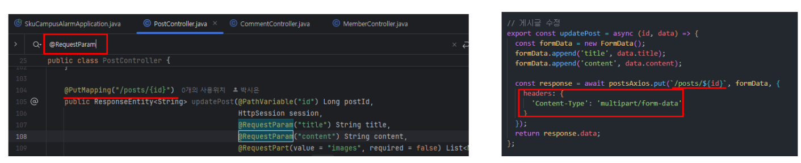

<br>

# 1. HTTP Content-Type

## 1.1 HTTP Content-Type 헤더

> HTTP Content-Type 헤더는 클라이언트(보통 웹 브라우저)와 서버 간의 통신에서 전송되는 데이터의 타입을 명시하는 데 사용된다.

- 이 헤더는 서버가 클라이언트에게 응답을 보낼 때 응답 본문의 콘텐츠가 어떤 형식인지 알려준다.
- 예를 들어, 웹 브라우저가 서버로부터 데이터를 받을 때 이 헤더를 참조하여 해당 데이터를 어떻게 처리할지 결정한다.

<br>

## 1.2 Content-Type의 역할

> 클라이언트에서 서버로 요청 시

- 클라이언트는 Content-Type 헤더를 설정하여 서버에 어떤 형식의 데이터를 전송하고 있는지 알린다.
- 예를 들어, JSON 데이터를 전송할 때는 Content-Type: application/json을 사용한다.

> 서버에서 클라이언트로 응답 시

- 서버는 응답 본문을 보낼 때 Content-Type을 설정하여 클라이언트가 데이터를 올바르게 해석할 수 있도록 한다.
- 예를 들어, HTML 페이지를 응답할 때는 Content-Type: text/html을 사용하여 브라우저가 HTML로 렌더링할 수 있도록 한다.

<br>

> Content-Type을 설정하지 않았을 경우, `application/x-www-form-urlencoded; charset=UTF-8` 타입으로 지정된다.

- 따라서 Content-Type 헤더를 명시하여 데이터의 해석을 명확히 해야한다.
- ⚠️ axios는 기본적으로 JSON 데이터를 전송할 때 Content-Type: application/json을 자동으로 설정한다. 따라서 별도로 Content-Type을 설정할 필요가 없다! (그래서 지금껏 오류가 안 났던거군...)

<br>

## 1.3 Content-Type의 형식

> Content-Type 헤더는 다음과 같은 형식으로 지정된다.

```
Content-Type: type/subtype; charset=UTF-8
```

- `type/subtype`
  - MIME 타입으로, 데이터의 종류를 나타낸다.
  - 예를 들어, text/html, application/json, image/png 등이 있다.
- `charset`
  - 선택 사항으로, 텍스트 데이터의 문자 인코딩을 나타낸다.
  - 예를 들어 charset=UTF-8은 UTF-8 인코딩을 의미한다.

<br>

# 2. Content-Type 에 들어가는 MIME type

## 2.1 MIME 타입

> HTTP Content-Type 헤더의 값에는 MIME type(media type) 이 들어간다.

- MIME 타입은 파일의 형식과 콘텐츠 유형을 정의하는데, 타입과 서브타입으로 나뉜다.
- 타입은 데이터의 주요 카테고리를, 서브타입은 그 카테고리 내의 구체적인 형식을 나타낸다.
  - 타입: 데이터의 주요 카테고리 (예: text, image, audio)
  - 서브타입: 카테고리 내의 구체적인 형식 (예: plain, jpeg, mp3)
  - 예시: text/html, image/png, application/json
- HTML 폼을 통해 데이터를 제출할 때 Content-Type을 명시하지 않으면, 기본적으로 `application/x-www-form-urlencoded`로 처리된다.

## 2.2 주요 MIME 타입

> 텍스트 (text)

| MIME 타입  | 설명            |
| ---------- | --------------- |
| text/plain | 일반 텍스트     |
| text/html  | HTML 문서       |
| text/css   | CSS 스타일 시트 |

> 이미지 (image)

| MIME 타입  | 설명        |
| ---------- | ----------- |
| image/jpeg | JPEG 이미지 |
| image/png  | PNG 이미지  |
| image/gif  | GIF 이미지  |

> 비디오 (video)

| MIME 타입        | 설명       |
| ---------------- | ---------- |
| video/mp4        | MP4 비디오 |
| video/x-matroska | MKV 비디오 |

> 오디오 (audio)

| MIME 타입  | 설명       |
| ---------- | ---------- |
| audio/mpeg | MP3 오디오 |
| audio/wav  | WAV 오디오 |

> 애플리케이션 (application)

| MIME 타입                | 설명                 |
| ------------------------ | -------------------- |
| application/json         | JSON 데이터          |
| application/xml          | XML 데이터           |
| application/octet-stream | 일반 바이너리 데이터 |

> 멀티파트 (multipart)

| MIME 타입             | 설명                                        |
| --------------------- | ------------------------------------------- |
| multipart/form-data   | 파일 업로드와 같은 복합 폼 데이터           |
| multipart/alternative | 여러 형식의 콘텐츠를 포함하는 이메일 메시지 |

<br>

# 3. 예시

## 3.1 JSON 데이터 전송

> 서버에 JSON 형식의 데이터를 전송할 때 Content-Type을 `application/json`으로 설정한다.

```jsx
const axios = require("axios");

async function postJsonData() {
  try {
    const response = await axios.post(
      "https://example.com/api/data",
      {
        key1: "value1",
        key2: "value2",
      },
      {
        headers: {
          "Content-Type": "application/json",
        },
      }
    );

    console.log("Response Data:", response.data);
  } catch (error) {
    console.error("Error:", error);
  }
}

postJsonData();
```

<br>

## 3.2 폼 데이터 전송

> 폼 데이터를 전송할 때는 두 가지 주요 방식이 있다.

1. `application/x-www-form-urlencoded`: 전통적인 HTML 폼 제출 방식, qs.stringify를 사용하여 데이터를 쿼리 문자열 형식으로 변환하여 전송
2. `multipart/form-data`: 파일 업로드와 같은 복합 데이터 전송에 사용

➡️ 먼저 `application/x-www-form-urlencoded`을 사용하여 폼 데이터 전송하는 방법에 대해 알아보자

<br>

> 폼 데이터를 전송할 때는 FormData 객체를 추가하고, Content-Type을 `application/x-www-form-urlencoded`로 설정한다.

```jsx
import axios from "axios";
const qs = require("qs"); // 쿼리 문자열을 쉽게 만들기 위해 사용

const formData = {
  name: "홍길동",
  email: "hong@example.com",
};

const submitData = async () => {
  try {
    const response = await axios.post(
      "https://api.example.com/submit",
      qs.stringify(formData),
      {
        headers: {
          "Content-Type": "application/x-www-form-urlencoded",
        },
      }
    );
    console.log(response.data);
  } catch (error) {
    console.error("Error:", error);
  }
};

submitData();
```

> qs.stringify?

- qs.stringify는 자바스크립트 객체를 쿼리 문자열 형식으로 변환하는 함수이다.
- 쿼리 문자열은 URL에서 사용되는 형식으로, 일반적으로 key=value 쌍으로 구성된다.

<br>

객체를 `qs.stringify`를 사용하여 쿼리 문자열로 변환해보자

```js
const qs = require("qs");

// 객체
const params = {
  name: "Alice",
  age: 25,
  city: "Wonderland",
};

// 객체를 쿼리 문자열로 변환
const queryString = qs.stringify(params);

console.log(queryString);
// 출력: name=Alice&age=25&city=Wonderland ->  URL 쿼리 파라미터에서 사용하는 형식과 동일
```

- qs.stringify를 사용하여 객체를 쿼리 문자열 형식으로 변환하고, Content-Type을 `application/x-www-form-urlencoded`로 설정하여 폼 데이터를 전송한다.
- 객체를 쿼리 문자열로 변환하는 이유는,
  - ① 서버가 데이터를 쉽게 파싱할 수 있기 때문이다.
  - ② 쿼리 문자열은 데이터 구조가 단순할 때(예: 키-값 쌍) 간결하게 표현할 수 있어, 전송할 데이터의 크기를 줄일 수 있기 때문이다.
  - 즉, 웹에서 데이터 전송을 간편하게 처리하기 위함이다.

<br>

## 3.3 파일 업로드

> 파일을 업로드할 때는 FormData 객체에 파일을 추가하고, Content-Type을 `multipart/form-data`로 설정한다.

```jsx
import axios from "axios";

const uploadFile = async (file) => {
  const formData = new FormData();
  formData.append("file", file);

  try {
    const response = await axios.post("/api/upload", formData, {
      headers: { "Content-Type": "multipart/form-data" },
    });
    console.log(response.data);
  } catch (error) {
    console.error(
      "Error:",
      error.response ? error.response.data : error.message
    );
  }
};

// 예시: fileInput은 파일 입력 요소의 참조
const fileInput = document.querySelector('input[type="file"]');
fileInput.addEventListener("change", () => {
  if (fileInput.files.length > 0) {
    uploadFile(fileInput.files[0]);
  }
});
```

```jsx
// 게시글 작성
export const createPost = async (data) => {
  const formData = new FormData();
  formData.append("title", data.title);
  formData.append("content", data.content);

  const response = await postsAxios.post("/posts/new", formData, {
    headers: {
      "Content-Type": "multipart/form-data",
    },
  });
  return response.data;
};
```

<br>

# 4. 부록(스프링 코드만 보고 헤더 타입 확인하기)

API 명세서에 파일 업로드나 특정 요청 형식이 명시되어 있지 않을 경우, 다음과 같은 방법을 통해 요청 형식을 확인할 수 있다.

> ① Spring Controller에서 @RequestParam 검색

`@RequestParam`은 주로 폼 데이터와 파일 업로드를 처리하는 데 사용된다. 이를 통해 요청의 형식을 추측할 수 있다.

> ② 요청의 Content-Type 설정

`@RequestParam`이 사용된 경우, 클라이언트는 반드시 요청의 `Content-Type`을 `multipart/form-data`로 설정해야 한다.

> ③ 백엔드 코드가 없을 경우

- 백엔드 개발자에게 요청 시 어떤 형식의 데이터를 보내야 하는지 확인해야한다.
- 파일 업로드가 필요한지, JSON 형식이 필요한지 등을 물어보고, 이에 맞는 요청 형식을 설정하면 된다.



<br>

# 참조

- [http content-type 관한 정리](https://yunzema.tistory.com/186)
- [https://jake-seo-dev.tistory.com/478 [제이크서 위키 블로그:티스토리]](https://jake-seo-dev.tistory.com/478)

<br>
