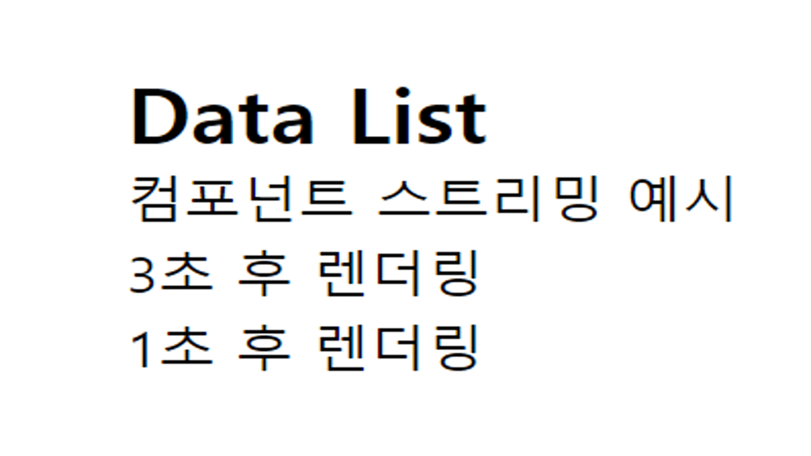

<br>

# 1. Streaming

## 1.1 Streaming이란?

> Streaming은 데이터를 실시간으로 전송하여 사용자가 필요한 정보를 즉시 이용할 수 있게 하는 기술이다.

- Streaming은 데이터를 한 번에 모두 보내는 것이 아니라, 부분적으로 차례차례 전송하는 방식을 의미한다.
- 전체 데이터가 완전히 전송될 때까지 기다리지 않고도 일부 데이터를 사용하거나 재생할 수 있도록 한다.
- React에서는 서버에서 클라이언트로 데이터를 점진적으로 전달하는 데 사용한다.

<br>

> Streaming 기술 활용 예시

- React 18
  - React 18에서는 서버 컴포넌트와 스트리밍 기능이 도입되어, 서버에서 클라이언트로 데이터를 실시간으로 스트리밍할 수 있게 되었다.
  - 이를 통해 사용자는 페이지가 완전히 로드될 때까지 기다리지 않고도 일부 콘텐츠를 즉시 확인할 수 있다.
- 비디오 스트리밍 서비스
  - 넷플릭스, 유튜브와 같은 비디오 스트리밍 서비스에서는 전체 비디오 파일이 다운로드되지 않고도 즉시 재생이 시작된다.
  - 사용자는 비디오의 일부만 다운로드된 상태에서도 재생을 시작할 수 있어, 기다리는 시간을 줄일 수 있다.
- 음악 스트리밍 서비스
  - 스포티파이와 같은 음악 스트리밍 서비스에서는 사용자가 노래를 클릭하면, 전체 음원이 다운로드되지 않고도 즉시 재생이 시작된다.

<br>

## 1.2 React에서 Streaming이 필요한 이유

> 사용자가 데이터를 기다리는 동안 빈 화면을 보지 않도록 하기 위해 스트리밍이 필요하다.

- 만약 `data2`는 1초 만에 준비되지만, `data1`이 3초가 걸린다면, 사용자는 `data1`이 준비될 때까지 빈 화면을 보게 된다.
- React 18에서는 Streaming 개념을 도입하여 데이터를 비동기적으로 스트리밍할 수 있는 방법을 제공한다.
- 서버는 데이터를 준비된 부분부터 클라이언트로 전송하면, 클라이언트는 데이터를 점진적으로 받아 사용자에게 렌더링하기 때문에 데이터가 준비될 때마다 즉시 화면에 표시할 수 있다.

<br>

## 1.3 페이지 단위의 스트리밍

> 페이지 단위 스트리밍은 React 18의 서버 컴포넌트 기능을 활용하여 **페이지를 점진적으로 렌더링**하는 방식이다.

- 이를 통해 페이지의 일부가 준비되면 그 부분을 먼저 보여주고, 나머지 부분은 나중에 로드하는 방식으로 빠르게 페이지를 렌더링할 수 있다.
- Next.js App Router는 페이지 단위의 스트리밍을 기본으로 제공한다.

```
📂 app
  ├── 📄 loading.tsx
  ├── 📄 layout.tsx
  └── 📄 page.tsx
```

<br>

- `loading.tsx`는 Next.js에서 제공하는 기능 중 하나로 페이지 단위의 스트리밍을 지원한다.
- 아래서 설명할 `Suspense`의 `fallback` 역할을 해줘 페이지 이동 시에 생기는 로딩을 보여준다.

```tsx
// app/loading.tsx

export default function Loading() {
  return <div>Loading...</div>;
}
```

```tsx
// app/layout.tsx

import "./globals.css";

export default function RootLayout({
  children,
}: Readonly<{
  children: React.ReactNode;
}>) {
  return (
    <html lang="ko">
      <body>
        <nav>Data List</nav>
        {children}
      </body>
    </html>
  );
}
```

```tsx
// page.tsx

// 3초 걸리는 함수
const delay3Seconds = async (): Promise<string> => {
  return new Promise((resolve) => {
    setTimeout(() => resolve("3초 후 렌더링"), 3000);
  });
};

// 1초 걸리는 함수
const delay1Second = async (): Promise<string> => {
  return new Promise((resolve) => {
    setTimeout(() => resolve("1초 후 렌더링"), 1000);
  });
};

export default async function Page() {
  // 비동기 데이터 로드
  const data1 = await delay3Seconds();
  const data2 = await delay1Second();

  return (
    <section>
      <div>{data1}</div>
      <div>{data2}</div>
    </section>
  );
}
```


<br>

> 페이지 단위의 스트리밍은 아래와 같은 단점이 존재한다.

- 페이지 단위로 streaming이 이루어지기 때문에, 두 개의 데이터 (data1, data2)를 페이지가 로드될 때 한 번에 가져온다.
- 위 예시처럼 `data1`은 1초만에 완료되더라도 `data2`이 3초가 걸린다면, 사용자는 `data2`가 완료될 때까지 기다려야 한다.
- 따라서 컴포넌트 단위의 스트리밍이 필요하다.

<br>

## 1.4 컴포넌트 단위의 스트리밍: Suspense

> 컴포넌트 단위의 스트리밍은 페이지의 일부 **컴포넌트를 점진적으로 렌더링**하는 방식이다.

- 이 방식은, 각 컴포넌트를 별도로 스트리밍할 수 있어 사용자는 준비가 완료된 컴포넌트를 즉시 볼 수 있다.
- React의 `Suspense`를 사용하면 컴포넌트 단위의 스트리밍을 구현할 수 있다.

<br>

> Suspense란?

- Suspense 바운더리가 감싸진 컴포넌트 내부가 특정 조건이 완료(e.g. 데이터 패칭 완료)가 될 때까지 등장을 연기하게 해준다.
- Suspense는 자식 컴포넌트가 렌더링되기 전에 비동기적으로 데이터를 로드한다. 데이터가 로드되지 않으면 fallback으로 지정된 로딩 UI가 대신 보여진다.
- 결과적으로 Suspense가 감싸진 단위로 chunk를 나누어 서버의 렌더링 결과물이 클라이언트로 전달되게 된다.

<br>

위와 같이 3초라는 굉장히 긴 시간의 비동기 작업이 화면 전체의 등장을 블로킹 한다면, 해당 컴포넌트에 streaming을 적용하는 것은 TTFB(Time To First Byte)에 유의미한 개선을 가져다 줄 수 있으며, 먼저 렌더링된 부분부터 hydration이 이루어지기 때문에 TTI(Time To Interact) 지표 역시 개선할 수 있다.

<br>

> Suspense로 컴포넌트 단위의 스트리밍 구현 예시

① 데이터가 로드되는 동안 보여줄 로딩 UI를 정의한다.

이 컴포넌트는 Suspense의 fallback 프로퍼티를 통해 지정된다.

```tsx
// app/loading.tsx
export default function Loading() {
  return <div>Loading...</div>;
}
```

<br>

② 그 후, 각각의 데이터를 로드하는 비동기 컴포넌트를 생성한다.

```tsx
// app/components/Data1.tsx
const delay3Seconds = async (): Promise<string> => {
  return new Promise((resolve) => {
    setTimeout(() => resolve("3초 후 렌더링"), 3000);
  });
};

export default async function Data1() {
  const data = await delay3Seconds();
  return <div>{data}</div>;
}
```

```tsx
// app/components/Data2.tsx
const delay1Second = async (): Promise<string> => {
  return new Promise((resolve) => {
    setTimeout(() => resolve("1초 후 렌더링"), 1000);
  });
};

export default async function Data2() {
  const data = await delay1Second();
  return <div>{data}</div>;
}
```

<br>

③ 그 후, 각각의 데이터 fetching 함수를 별도의 컴포넌트로 만들어 `Suspense` 바운더리로 감싸서 각 **컴포넌트**가 비동기적으로 로드될 수 있도록 하면 된다.

이로 인해 Data1이 3초가 걸리더라도, Data2는 1초 후에 바로 렌더링되어 사용자는 더 빨리 결과를 볼 수 있다.

```tsx
// app/page.tsx
import { Suspense } from "react";

import Loading from "@/app/loading";
import Data1 from "@/app/components/Data1";
import Data2 from "@/app/components/Data2";

export default function MainPage() {
  return (
    <section>
      <h1>컴포넌트 스트리밍 예시</h1>
      <Suspense fallback={<Loading />}>
        <Data1 />
      </Suspense>
      <Suspense fallback={<Loading />}>
        <Data2 />
      </Suspense>
    </section>
  );
}
```



<br>

> Suspense의 `fallback`을 사용하면 Network Preview 탭 가면 로딩 중만 떠서 SEO가 안 되는 것 처럼 보이지만, Response를 자세히 보시면 hidden 상태로 원하는 값이 들어와 있다.

SEO 정보는 metadata를 통해 추가로 전하면 된다.


<br><br>

# 2. 서버컴포넌트에서의 React Query와 데이터 패칭

## 2.1 서버컴포넌트에서 React Query 사용하는 방법

> React Query는 훅(hook) 기반의 API를 제공하기 때문에 정석적인 useQuery를 사용하는 방식으로 서버컴포넌트에서 데이터 패칭을 하기 어렵다.

그렇다면 왜 서버컴포넌트에서 데이터 패칭을 하는 것이 중요할까?

1. 빠른 초기 로드: 컴포넌트가 렌더될 때 필요한 데이터를 미리 패칭하도록 설정할 수 있어, 사용자가 페이지에 처음 도착했을 때 데이터를 미리 로드해, 로딩 시간을 단축할 수 있다.
2. 캐시된 데이터 재사용: useQuery를 통해 데이터가 이미 캐시에 있을 경우, 네트워크 요청 없이 바로 캐시된 데이터를 사용한다.
3. SEO 개선: 서버 측에서 데이터를 미리 패칭하면, 클라이언트 사이드에서 데이터 로드가 필요하지 않아 SEO에 유리하다.

<br>

> SSR 환경에서는 사용자의 요청이 있을 때마다 서버에서 페이지를 새로 렌더링하여 사용자에게 제공한다. 이때 데이터 패칭 과정은 두 단계로 나뉜다.

- Pre-rendering
  - 서버에서 미리 HTML을 생성하여 클라이언트에 전달하는 방식(사용자와 상호작용하는 부분을 제외한 껍데기만을 먼저 브라우저에게 제공)
  - 그 HTML이 생성되기 위해 데이터가 필요할 때 prefetch를 사용한다.
- hydration
  - 클라이언트에서 서버로부터 받은 HTML을 받아 React 컴포넌트와 상태를 연결(하이드레이션)하여, 페이지가 인터랙티브하게 작동할 수 있도록 만드는 과정
  - 이때 서버에서 미리 패칭된 데이터가 클라이언트에서 다시 "활성화" 된다.

💡즉, prefetch는 서버에서 데이터를 미리 가져오는 작업이고, hydration은 그 데이터를 클라이언트에서 활성화하는 작업이다.(Hydration에 대한 자세한 설명은 [[여기↗️]](https://mynamesieun.github.io/next.js/2-Rendering-%EA%B8%B0%EB%B2%95(CSR,-SSG,-ISR,-SSR,-Hydration)/)를 참고하자)

<br>

> ReactQuery를 사용하여 SSR환경에서 데이터 패칭을 구현하는 방법은 두 가지가 존재한다.

1. 서버컴포넌트에서 데이터를 `prefetch`하는 방법
2. `ReactQueryStreamedHydration`을 사용하여 prefetch 없이 스트리밍을 할 수 있는 방법📌

먼저 prefetch를 사용한 방법을 살펴보자.

<br>

## 2.2 prefetch (with prefetchQuery)

> React Query는 기본적으로 클라이언트에서 데이터를 가져오는 방식이기 때문에, 서버 측에서는 데이터를 미리 페칭(pre-fetch)해 놓고 클라이언트가 렌더링할 때 사용할 수 있도록 하는 방식이 필요하다.

- `prefetch`는 페이지나 컴포넌트를 렌더링하기 전에 서버에서 데이터를 미리 **패칭(pre-fetch)**하여 캐시에 저장하는 기능이다.
- 서버 컴포넌트에서 useQuery를 사용하는 방식은 불가능하지만, `prefetchQuery`를 사용하여 데이터를 미리 불러올 수 있다!
- React Query에서의 `prefetch`는 `prefetchQuery` 메서드를 통해 구현된다.

<br>

> Prefetch Query 사용법

① 서버컴포넌트에서 데이터 미리 패칭하기

1. `queryClient.prefetchQuery` 메서드를 사용하여 서버에서 데이터를 미리 가져온다.
2. 가져온 데이터를 `dehydrate`로 직렬화하고, 이를 `HydrationBoundary`로 클라이언트에 전달한다.

```tsx
import TodoList from "@/app/components/TodoList";
import { QUERY_KEYS } from "@/app/hooks/query/keys.constant";
import { fetchTodos } from "@/app/services/todos";
import {
  dehydrate,
  HydrationBoundary,
  QueryClient,
} from "@tanstack/react-query";

// 서버 컴포넌트로 정의
const HomePage = async () => {
  const queryClient = new QueryClient();

  // 서버에서 데이터 프리패칭
  await queryClient.prefetchQuery({
    queryKey: [QUERY_KEYS.TODOS],
    queryFn: fetchTodos,
  });

  return (
    <main>
      {/* 미리 프리패칭된 데이터를 클라이언트로 전달 */}
      <HydrationBoundary state={dehydrate(queryClient)}>
        <TodoList />
      </HydrationBoundary>
    </main>
  );
};

export default HomePage;
```

- `queryClient.prefetchQuery`를 사용해 fetchTodos 함수로 데이터를 서버에서 미리 가져온다.
- `dehydrate`는 서버에서 불러온 데이터를 클라이언트로 전송하기 위한 직렬화(serialize) 과정을 말하며, `HydrationBoundary`는 이러한 직렬화된 데이터를 클라이언트에서 사용할 수 있도록 한다.
- 💡 즉, 위 코드는 서버 컴포넌트이므로 서버에서 디하이드레이션된 상태(물을 채우지 않은 상태)로 데이터를 보내고, 클라이언트에서 그 데이터를 "하이드레이트"(컴포넌트에 물을 채움)하면서 React Query를 통해 상태를 활성화하는 것이다.

<br>

② 클라이언트 컴포넌트에서 Hydrate 사용하기

- 서버에서 미리 가져온 데이터는 클라이언트 컴포넌트에서 useQuery 훅을 통해 사용할 수 있다.
- `HydrationBoundary`로 전달된 데이터는 클라이언트에서 데이터를 가져올 때 자동으로 활용되며, 데이터 요청 없이 즉시 화면에 표시된다.

```tsx
"use client";

import { useTodosQuery } from "../hooks/query/useTodosQuery";
import { Todo } from "../types/todo-types";

const TodoList = () => {
  // 클라이언트에서 데이터를 가져옴 (서버에서 미리 패치된 데이터 사용)
  const { data: todos, isLoading, error } = useTodosQuery();

  // 로딩 중 처리
  if (isLoading) {
    return <p>로딩중...</p>;
  }

  // 에러 중 처리
  if (error) {
    return <p>에러 발생: {error.message}</p>;
  }

  return (
    <div>
      {todos.map((todo: Todo) => (
        <ul key={todo.id}>
          <li>제목: {todo.title}</li>
          <li>내용: {todo.content}</li>
        </ul>
      ))}
    </div>
  );
};

export default TodoList;
```

💡 `prefetchQuery`가 없으면 클라이언트 사이드 렌더링처럼 작동하기 때문에 SEO가 제대로 인식하지 못할 수 있지만, `prefetchQuery`를 사용하면 초기 로드 시 데이터를 미리 받아오기 때문에 SEO 성능이 향상된다.

<br>

③ Todo APP에 Suspense를 사용해서 스트리밍을 적용해보자!

- 위 예시에서 스트리밍을 적용하려면 `Suspense`를 활용하여 비동기적으로 데이터를 가져오는 컴포넌트들을 각각 렌더링할 수 있게 해야한다.
- 각각의 데이터 요청을 Suspense로 감싸자.

```tsx
import TodoList from "@/app/components/TodoList";
import { QUERY_KEYS } from "@/app/hooks/query/keys.constant";
import { fetchTodos } from "@/app/services/todos";
import {
  dehydrate,
  HydrationBoundary,
  QueryClient,
} from "@tanstack/react-query";

// 서버 컴포넌트로 정의
const HomePage = async () => {
  const queryClient = new QueryClient();

  // 서버에서 데이터 프리패칭
  await queryClient.prefetchQuery({
    queryKey: [QUERY_KEYS.TODOS],
    queryFn: fetchTodos,
  });

  return (
    <main>
      <HydrationBoundary state={dehydrate(queryClient)}>
        <Suspense fallback={<div>로딩...</div>}>
          <TodoList title="inProgress" />
        </Suspense>
        <Suspense fallback={<div>로딩...</div>}>
          <TodoList title="isDone" />
        </Suspense>
      </HydrationBoundary>
    </main>
  );
};

export default HomePage;
```


<br>

## 2.3 Client Stream Hydration(권장)📌

> Client Stream Hydration은 **서버 사이드 렌더링(SSR)**과 React의 Hydration을 결합한 최적화된 데이터 로딩 기법이다.

- 서버에서 데이터를 스트리밍하고, 클라이언트에서 이를 점진적으로 재활성화(hydrate)하여 더 빠르고 효율적인 페이지 로딩을 제공한다.
- 이 방법은 `useSuspenseQuery`를 사용하여 `prefetch` 없이 데이터를 서버에서 스트리밍하는 방식으로, Next.js의 useServerInsertedHTML API와 결합된다.
- 현재 정식 출시되지 않았고, 실험적 기능으로 제공되고 있다.

<br>

> Client Stream Hydration 사용하기

[[공식문서↗️]](https://tanstack.com/query/latest/docs/framework/react/guides/advanced-ssr)의 맨 아래에 사용법이 나와있으니 자세한 사용법은 공식문서를 참고하자.

① 설치

```shell
yarn add @tanstack/react-query-next-experimental
```

<br>

② React Query Client 및 Provider 설정

- Next.js의 **app directory**에서는 기본적으로 모든 컴포넌트가 서버 컴포넌트로 동작한다.
- 따라서, 클라이언트에서 `React Query`와 `Streamed Hydration`을 설정하려면, 클라이언트 컴포넌트로 지정된 별도의 컴포넌트를 만들어야 한다.
- 클라이언트 사이드에서 동작하는 provider 컴포넌트를 별도로 만들어 초기화해주자.

```tsx
"use client"; // 클라이언트 컴포넌트로 지정

import { QueryClient, QueryClientProvider } from "@tanstack/react-query";
import { ReactQueryDevtools } from "@tanstack/react-query-devtools";
import { ReactQueryStreamedHydration } from "@tanstack/react-query-next-experimental";

// 클라이언트 컴포넌트로 React Query Provider 정의
const Providers = ({ children }: { children: React.ReactNode }) => {
  const queryClient = new QueryClient();

  return (
    <QueryClientProvider client={queryClient}>
      <ReactQueryStreamedHydration>{children}</ReactQueryStreamedHydration>
      <ReactQueryDevtools initialIsOpen={false} />
    </QueryClientProvider>
  );
};

export default Providers;
```

- ReactQueryStreamedHydration:
  - 서버에서 데이터를 스트리밍하여 클라이언트에서 해당 데이터를 점진적으로 **재활성화(hydrate)**하는 데 사용된다. 이를 통해 빠른 초기 렌더링과 동적 데이터 로딩을 구현할 수 있다.
  - 이 태그로 감싸주면 `prefetch` 하지 않아도 된다.

<br>

③ useSuspenseQuery 사용

- `useQuery` 대신 `useSuspenseQuery`를 사용해야 한다.
- 이 훅은 `Suspense`를 활용하여 데이터가 로딩되는 동안 스트리밍된 데이터를 처리할 수 있게 한다.
- 즉, 서버 사이드 렌더링 동안 화면 이동을 막지 않고 바로 로딩 화면을 보여준다.

```tsx
"use client";

import { useSuspenseQuery } from "@tanstack/react-query";

import axios from "axios";
import { QUERY_KEYS } from "@/app/hooks/query/keys.constant";
import { Todo } from "@/app/types/todo-types";

export const fetchTodos = async () => {
  try {
    const response = await axios.get("http://localhost:4000/todos");
    return response.data;
  } catch (error) {
    console.error(error);
  }
};

export default function HomePage() {
  const {
    data: todos,
    isLoading,
    error,
  } = useSuspenseQuery({
    queryKey: [QUERY_KEYS.TODOS],
    queryFn: fetchTodos,
  });

  if (isLoading) {
    return <p>로딩중...</p>;
  }

  if (error) {
    return <p>에러 발생!</p>;
  }

  return (
    <div>
      {todos?.map((todo: Todo) => (
        <ul key={todo.id}>
          <li>{todo.title}</li>
          <li>{todo.content}</li>
        </ul>
      ))}
    </div>
  );
}
```


<br><br>

# 참조

- [React Query 환경에서 Next.js와 streaming 이용하기](https://velog.io/@stakbucks/React-Query%EC%99%80-streaming-%ED%95%98%EA%B8%B0)
- [Next.js 14에서 React-query 사용하기](https://velog.io/@gygy/Next.js-14%EC%97%90%EC%84%9C-React-query-%EC%82%AC%EC%9A%A9%ED%95%98%EA%B8%B0)
- [서버에서 React Query prefetching 한 데이터 사용하기](https://soobing.github.io/react/server-rendering-and-react-query/)
- [Next와 React-query의 prefetch에 대해](https://www.inflearn.com/community/questions/1230948/next%EC%99%80-react-query%EC%9D%98-prefetch%EC%97%90-%EB%8C%80%ED%95%B4)

<br>
