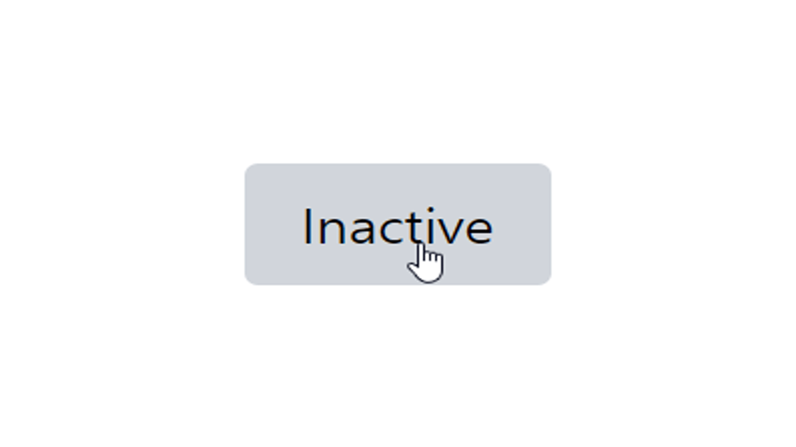

<br>

# 1. clsx 라이브러리 소개

> `clsx`는 클래스 이름을 쉽게 전환할 수 있게 해주는 라이브러리이다.

`clsx`를 사용하여 조건부로 클래스명을 쉽게 적용할 수 있다.

<br><br>

# 2. 설치

```shell
yarn add clsx
```

<br><br>

# 3. 사용하기

## 3.1 예제1: 간단한 상태 기반 스타일 적용

> 아래 예제는 버튼의 활성/비활성 상태에 따라 버튼의 배경색과 텍스트 색상이 동적으로 변경되는 코드이다.

isActive 상태를 기반으로 스타일이 결정된다.

```tsx
"use client";

import { useState } from "react";
import clsx from "clsx";

const HomePage = () => {
  const [isActive, setIsActive] = useState(false);

  return (
    <div>
      <button
        className={clsx(
          "px-4 py-2 rounded", // 기본 스타일
          isActive ? "bg-blue-500 text-white" : "bg-gray-300 text-black" // 조건부 스타일
        )}
        onClick={() => setIsActive(!isActive)}
      >
        {isActive ? "Active" : "Inactive"}
      </button>
    </div>
  );
};

export default HomePage;
```



<br>

## 3.2 예제2: props에 따른 스타일 적용

> InvoiceStatus라는 컴포넌트를 만들고, status 값을 기반으로 배경과 텍스트 색상을 조건부로 변경하는 코드이다.

pending 상태일 때는 회색, paid 상태일 때는 녹색 배경을 적용한다.

```tsx
// /app/ui/invoices/status.tsx
import clsx from "clsx";

export default function InvoiceStatus({ status }: { status: string }) {
  return (
    <span
      className={clsx(
        "inline-flex items-center rounded-full px-2 py-1 text-sm", // 기본 클래스
        {
          "bg-gray-100 text-gray-500": status === "pending", // pending 상태
          "bg-green-500 text-white": status === "paid", // paid 상태
        }
      )}
    >
      {status === "pending" ? "Pending" : "Paid"}
    </span>
  );
}
```

<br>

> `status` 값을 넘겨주면 그에 따라 자동으로 스타일이 적용된다.

```tsx
import InvoiceStatus from "./ui/invoices/status";

function HomePage() {
  return (
    <div>
      <h1>Invoice Status</h1>
      <InvoiceStatus status="pending" /> {/* 회색 배경 */}
      <InvoiceStatus status="paid" /> {/* 녹색 배경 */}
    </div>
  );
}

export default HomePage;
```


<br><br>

## 3.3 예제3: 활성화 된 링크 표시

> 사용자의 현재 경로를 URL에서 가져와야 하는데, Next.js의 `usePathname()` 훅을 사용하여 현재 경로를 확인하고 활성화된 링크를 구현할 수 있다.

```tsx
// app/components/layouts/Header.tsx

"use client"; // 클라이언트 컴포넌트로 변환

import Link from "next/link"; // Link 컴포넌트 가져오기
import { usePathname } from "next/navigation"; // usePathname 훅 가져오기
import clsx from "clsx"; // clsx 라이브러리 가져오기

const Navbar = () => {
  const pathname = usePathname(); // 현재 경로를 pathname 변수에 할당

  return (
    <nav>
      <ul className="flex space-x-4">
        <li>
          <Link
            href="/"
            className={clsx(
              "p-2 rounded", // 기본 스타일
              { "bg-sky-100 text-blue-600": pathname === "/" } // 활성화된 링크 스타일
            )}
          >
            홈
          </Link>
        </li>
        <li>
          <Link
            href="/about"
            className={clsx(
              "p-2 rounded", // 기본 스타일
              { "bg-sky-100 text-blue-600": pathname === "/about" } // 활성화된 링크 스타일
            )}
          >
            소개
          </Link>
        </li>
        <li>
          <Link
            href="/contact"
            className={clsx(
              "p-2 rounded", // 기본 스타일
              { "bg-sky-100 text-blue-600": pathname === "/contact" } // 활성화된 링크 스타일
            )}
          >
            연락처
          </Link>
        </li>
      </ul>
    </nav>
  );
};

export default Navbar;
```


<br><br>

# 참조

- [https://nextjs.org/learn](https://nextjs.org/learn)

<br>
