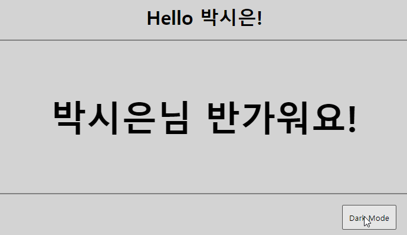

<br>

# 1. useContext 개요

## 1.1 react context 등장 배경

일반적으로 부모컴포넌트 → 자식 컴포넌트로 데이터를 전달해 줄 때 props를 사용하였다. 하지만, 이 방식으로 데이터를 전달했을 때 prop drilling 현상이 일어난다는 문제점이 있다.

> prop drilling의 문제점

1. 깊이가 너무 깊어지면 prop이 어떤 컴포넌트로부터 왔는지 파악이 어려워진다.
2. 어떤 컴포넌트에서 오류가 발생할 경우 추적이 힘들어지니 대처가 늦을 수 밖에 없다.<br><br>
   
   자료 : https://www.copycat.dev/blog/react-context/

따라서 이러한 문제를 해결하기 위해 react context API가 등장하게 되었다. useContext hook을 통해 쉽게 전역 데이터를 관리할 수 있다.

<br>

## 1.2 context API 필수 개념

- `createContext` : context 생성
- `Consumer` : context 변화 감지
- `Provider` : context 전달(to 하위 컴포넌트)

<br><br>

# 2. useContext 구현하기

## 2.1 예시 1

```js
import React from "react";
import "./App.css";

function App() {
  return (
    <div className="root">
      <h1>Hello World</h1>
      <Sub2 />
    </div>
  );
}

// 하위 컴포넌트
function Sub1() {
  return (
    <div>
      <h1>Sub1</h1>
      <Sub2 />
    </div>
  );
}

function Sub2() {
  return (
    <div>
      <h1>Sub2</h1>
      <Sub3 />
    </div>
  );
}

function Sub3() {
  return (
    <div>
      <h1>Sub3</h1>
    </div>
  );
}

export default App;
```

```css
/* App.css */
.root,
.root div {
  border: 10px solid gray;
  margin: 10px;
  padding: 10px;
}
```


<br>

> 위 컴포넌트의 border color을 Context를 사용하여 전부 초록색으로 바꿔보자

```js
import React, { createContext, useContext } from "react"; // (1) import
import "./App.css";

const themeDefault = { border: "10px solid green" }; // (2) 디자인 코드 작성
const themeContext = createContext(themeDefault); // (3) Context 만들기

function App() {
  const theme = useContext(themeContext); // (4) useContext에 사용할 Context를 표기
  // console.log(theme);

  return (
    <div className="root" style={theme}>
      {" "}
      {/* (5) 값 넣기 */}
      <h1>Hello World</h1>
      <Sub1 />
    </div>
  );
}

// 하위 컴포넌트
function Sub1() {
  const theme = useContext(themeContext);
  return (
    <div style={theme}>
      <h1>Sub1</h1>
      <Sub2 />
    </div>
  );
}

function Sub2() {
  const theme = useContext(themeContext);
  return (
    <div style={theme}>
      <h1>Sub2</h1>
      <Sub3 />
    </div>
  );
}

function Sub3() {
  const theme = useContext(themeContext);
  return (
    <div style={theme}>
      <h1>Sub3</h1>
    </div>
  );
}

export default App;
```

모든 컴포넌트들이 themeDefault값을 공유하게 됐다.


<br>

> 이 상태에서 Sub2와 Sub3의 테두리 색만 변경해보도록 하자.

Sub2의 부모 컴포넌트인 Sub1 컴포넌트에 `<themeContext.Provider>`으로 감싸주면 된다.

```js
function Sub1() {
  const theme = useContext(themeContext);
  return (
    // Provider컴포넌트는 value값을 작성해줘야한다.
    <themeContext.Provider value={{ border: "10px solid red" }}>
      <div style={theme}>
        <h1>Sub1</h1>
        <Sub2 />
      </div>
    </themeContext.Provider>
  );
}
```


즉, useContext를 사용하면 부모 컨텍스트의 첫 번째로 등장하는 Provider의 value가 리턴되는 것을 확인할 수 있다.

<br>

## 2.2 예시 2

> 다크 모드를 구현하는 코드이다.

<details>
  <summary>index.css</summary>

```css
/* index.css */
* {
  box-sizing: border-box;
  margin: 0;
  font-family: sans-serif;
}

.page {
  width: 100%;
  height: 100vh;
  display: flex;
  flex-direction: column;
}

.header {
  width: 100%;
  height: 80px;
  border-bottom: 2px solid gray;
  display: flex;
  justify-content: center;
  align-items: center;
}

.content {
  flex: 1;
  display: flex;
  justify-content: center;
  align-items: center;
  font-size: 30px;
}

.footer {
  width: 100%;
  height: 80px;
  border-top: 2px solid gray;
  display: flex;
  justify-content: flex-end;
  align-items: center;
}

.button {
  padding: 10px;
  margin-right: 30px;
}
```

</details>

<br>

```jsx
// src/App.jsx
import React, { useState } from "react";
import Page from "./components/Page";

function App() {
  const [isDark, setIsDark] = useState(false);
  return <Page isDark={isDark} setIsDark={setIsDark} />;
}

export default App;
```

```jsx
// src/components/Page.jsx
import React from "react";
import Content from "./Content";
import Footer from "./Footer";
import Header from "./Header";

function Page({ isDark, setIsDark }) {
  return (
    <div className="page">
      <Header isDark={isDark} />
      <Content isDark={isDark} />
      <Footer isDark={isDark} setIsDark={setIsDark} />
    </div>
  );
}

export default Page;
```

```jsx
// src/components/Header.jsx
import React from "react";

function Header({ isDark }) {
  return (
    <header
      className="header"
      style={{
        backgroundColor: isDark ? "black" : "lightgray",
        color: isDark ? "white" : "black",
      }}
    >
      <h1>Hello 사용자!</h1>
    </header>
  );
}

export default Header;
```

```jsx
// src/components/Content.jsx
import React from "react";

function Content({ isDark }) {
  return (
    <div
      className="content"
      style={{
        backgroundColor: isDark ? "black" : "lightgray",
        color: isDark ? "white" : "black",
      }}
    >
      <h1>사용자님 반가워요!</h1>
    </div>
  );
}
export default Content;
```

```jsx
// src/components/Footer.jsx
import React from "react";

function Footer({ isDark, setIsDark }) {
  const toggleThem = () => {
    setIsDark(!isDark);
  };
  return (
    <div
      className="footer"
      style={{
        backgroundColor: isDark ? "black" : "lightgray",
      }}
    >
      <button className="button" onClick={toggleThem}>
        Dark Mode
      </button>
    </div>
  );
}
export default Footer;
```


<br>

> 위 코드를 Context를 사용하여 개선해보자.

Page 컴포넌트는 isDark를 사용하고 있지 않다. 단지 자녀 컴포넌트들에게 값을 전달해 주는 중간 컴포넌트일 뿐이다.

따라서 Context를 사용해서 isDark라는 데이터를 모든 하위 컴포넌트들에게 props를 사용하지 않고 공유해보도록하자.

<br>

```js
// src/context/ThemContext.js
import { createContext } from "react"; // (1) import

// (2) Context 생성 (초기값 null, 상위 컴포넌트 value 없을 때 출력)
export const ThemContext = createContext(null);
```



```jsx
// src/App.jsx
import React, { useState } from "react";
import Page from "./components/Page";
import { ThemContext } from "./context/ThemContext"; // (1) 만든 Context import

function App() {
  const [isDark, setIsDark] = useState(false);

  return (
    // (2) 만든 Provider 로 감싸기
    // (3) value엔 전달하고자하는 데이터 넣기
    <ThemContext.Provider value={{ isDark, setIsDark }}>
      <Page /> {/* (4) props 지우기 (Context를 사용할 것이므로 필요 x) */}
    </ThemContext.Provider>
  );
}

export default App;
```



```jsx
// src/components/Page.jsx
import React, { useContext } from "react";
import Content from "./Content";
import Footer from "./Footer";
import Header from "./Header";
import { ThemContext } from "../context/ThemContext";

// (1) props 지우기
function Page() {
  // (2) useContext Hook으로 Context로 전달한 정보 받아오기
  const data = useContext(ThemContext);

  return (
    <div className="page">
      {/* (3) props 지우기 */}
      <Header />
      <Content />
      <Footer />
    </div>
  );
}

export default Page;
```



```jsx
// src/components/Header.jsx
import React, { useContext } from "react";
import { ThemContext } from "../context/ThemContext";

// (1) props 지우기
function Header() {
  // (2) useContext Hook으로 Context로 전달한 정보 받아오기
  const { isDark } = useContext(ThemContext);

  return (
    <header
      className="header"
      style={{
        backgroundColor: isDark ? "black" : "lightgray",
        color: isDark ? "white" : "black",
      }}
    >
      <h1>Hello 사용자!</h1>
    </header>
  );
}

export default Header;
```





```jsx
// src/components/Content.jsx
import React, { useContext } from "react";
import { ThemContext } from "../context/ThemContext";

// (1) props 지우기
function Content() {
  // (2) useContext Hook으로 Context로 전달한 정보 받아오기
  const { isDark } = useContext(ThemContext);

  return (
    <div
      className="content"
      style={{
        backgroundColor: isDark ? "black" : "lightgray",
        color: isDark ? "white" : "black",
      }}
    >
      <h1>사용자님 반가워요!</h1>
    </div>
  );
}
export default Content;
```





```jsx
// src/components/Footer.jsx
import React, { useContext } from "react";
import { ThemContext } from "../context/ThemContext";

// (1) props 지우기
function Footer() {
  // (2) useContext Hook으로 Context로 전달한 정보 받아오기
  const { isDark, setIsDark } = useContext(ThemContext);

  const toggleThem = () => {
    setIsDark(!isDark);
  };
  return (
    <div
      className="footer"
      style={{
        backgroundColor: isDark ? "black" : "lightgray",
      }}
    >
      <button className="button" onClick={toggleThem}>
        Dark Mode
      </button>
    </div>
  );
}
export default Footer;
```



<br>

> 더 연습해보기 위해 UseContext를 만들어주자

```js
// src/context/UserContext.js
import { createContext } from "react";
export const UserContext = createContext(null);
```



```jsx
// src/App.jsx
import React, { useState } from "react";
import Page from "./components/Page";
import { ThemContext } from "./context/ThemContext";
import { UserContext } from "./context/UserContext"; // (1) 만든 Context import

function App() {
  const [isDark, setIsDark] = useState(false);

  return (
    // (2) 만든 Provider 로 감싸기
    // (3) value엔 전달하고자하는 데이터 넣기
    <UserContext.Provider value={"박시은"}>
      <ThemContext.Provider value={{ isDark, setIsDark }}>
        <Page />
      </ThemContext.Provider>
    </UserContext.Provider>
  );
}

export default App;
```





```jsx
// src/components/Header.jsx
import React, { useContext } from "react";
import { ThemContext } from "../context/ThemContext";
import { UserContext } from "../context/UserContext"; // (1) import

function Header() {
  // (2) useContext Hook으로 Context로 전달한 정보 받아오기
  const { isDark } = useContext(ThemContext);
  const user = useContext(UserContext);

  return (
    <header
      className="header"
      style={{
        backgroundColor: isDark ? "black" : "lightgray",
        color: isDark ? "white" : "black",
      }}
    >
      {/* (3) 값 넣기 */}
      <h1>Hello {user}!</h1>
    </header>
  );
}

export default Header;
```





```jsx
// src/components/Content.jsx
import React, { useContext } from "react";
import { ThemContext } from "../context/ThemContext";
import { UserContext } from "../context/UserContext"; // (1) import

function Content() {
  // (2) useContext Hook으로 Context로 전달한 정보 받아오기
  const { isDark } = useContext(ThemContext);
  const user = useContext(UserContext);

  return (
    <div
      className="content"
      style={{
        backgroundColor: isDark ? "black" : "lightgray",
        color: isDark ? "white" : "black",
      }}
    >
      {/* (3) 값 넣기 */}
      <h1>{user}님 반가워요!</h1>
    </div>
  );
}
export default Content;
```





<br>

## 2.3 주의사항

> 재사용성

Context를 사용하면 컴포넌트를 재사용하기 어려워질 수 있다. 필요할 때만 사용하는 것이 좋다.

<br>

> 렌더링 문제

useContext를 사용할 때, Provider에서 제공한 value가 달라진다면 useContext를 사용하고 있는 모든 컴포넌트가 리렌더링 된다.

즉, value 부분을 항상 신경써줘야 한다. → 따라서 메모이제이션이 필요하다.

<br><br>

# 3. 참조

- https://www.youtube.com/watch?v=JQ_lksQFgNw

<br>
