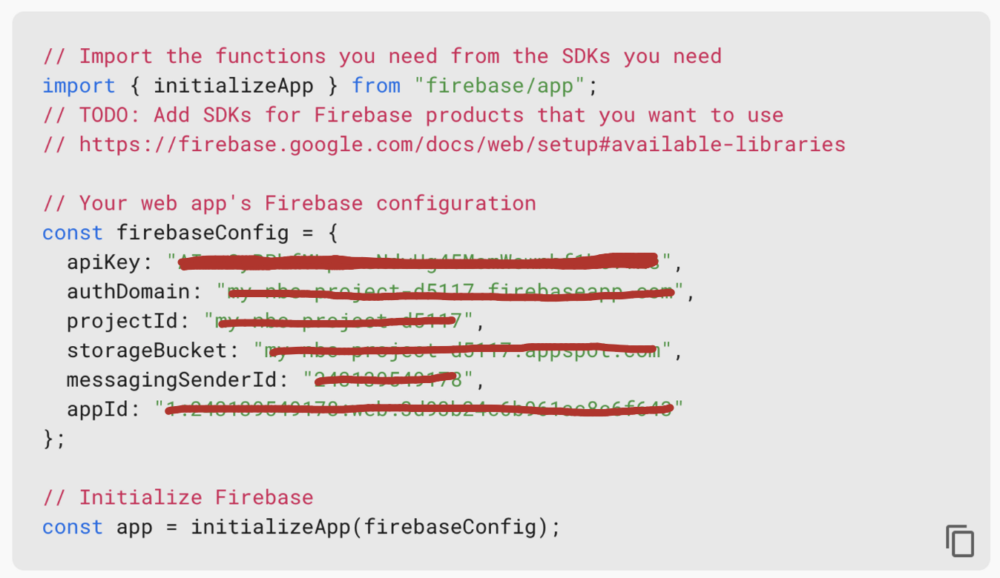

<br>

# 0. 컨벤션 정하기

- React Project Convention
- Github Convention
- `yarn` vs `npm`
  - 프로젝트 생성 이후에는 팀 내에서 npm, yarn 중 하나를 선택해서 사용하기
  - npm을 사용할 경우 package-lock.json 파일, yarn을 사용할 경우, yarn.lock 파일이 github에 함께 공유되어야 의존성 라이브러리들의 버전을 일관성있게 관리 할 수 있어 동일한 개발환경을 유지할 수 있다.

<br>

## 1. CRA 프로젝트 셋업

```shell
npx create-react-app {프로젝트명}
```

<br>

## 2. title 변경 (index.html)

<br>

## 3. .prettierrc 파일 만들기

- 팀원들과 코드포맷팅 규칙을 동일하게 설정하기 위해 root directory에 .prettierrc 파일 생성하기
- prettier 익스텐션 설치 및 format on save 설정을 해줘야한다. [[설정 방법 - 목차 1.2 참고](https://mynamesieun.github.io/etc/VS-code-%EC%9D%B5%EC%8A%A4%ED%85%90%EC%85%98-%EC%B6%94%EC%B2%9C/#11-korea-language-pack-for-visual-studio-code)]

```js
{
    "printWidth": 120,
    "tabWidth": 2,
    "useTabs": false,
    "semi": true,
    "singleQuote": true,
    "bracketSpacing": true,
    "trailingComma": "none"
}
```

<br>

## 4. jsconfig.json 생성해 절대 경로 지정하기

root directory에 생성해야한다.

```js
{
	"compilerOptions": {
		"baseUrl": "src"
	},
	"include": ["src"]
}
```

<br>

## 5. styled-components 설치

styled-components 사용시 css 파일은 전부 삭제해도 좋다.

```shell
yarn add styled-components
```

<br>

## 6. 폴더 구조 생성

프로젝트에 따라 유동적으로 생성하면 된다.


```less
my-app/
├── public/                     // 정적 파일들이 위치하는 폴더
│   ├── favicon.ico
│   └── index.html
└── src/                        // 소스 코드가 위치하는 폴더
    ├── App.jsx
    ├── index.jsx
    ├── apis/                   // API 호출 관련 모듈들이 위치하는 폴더
    ├── assets/                 // 정적 자원들을 포함하는 폴더
    │   └── images/
    │       ├── logo.png
    │       └── user.png
    ├── components/             // 리액트 컴포넌트들이 위치하는 폴더
    │   ├── common/             // 공통 컴포넌트들이 위치하는 폴더
    │   │   ├── Avatar.jsx
    │   │   └── Button.jsx
    │   ├── layouts/            // 페이지 레이아웃 관련 컴포넌트들이 위치하는 폴더
    │   │   ├── Footer.jsx
    │   │   ├── Header.jsx
    │   │   └── PageContainer.jsx
    │   ├── login/              // 로그인 관련 컴포넌트들이 위치하는 폴더
    │   │   └── TextInput.jsx
    │   └── user/               // 사용자 관련 컴포넌트들이 위치하는 폴더
    │       └── Select.jsx
    ├── config/                 // 프로젝트 설정 파일들이 위치하는 폴더
    │   └── tsconfig.json
    ├── context/                // 상태 관리를 위한 Context API 관련 파일들이 위치하는 폴더
    │   └── ThemeContext.jsx
    ├── hooks/                  // 재사용 가능한 커스텀 훅들이 위치하는 폴더
    │   └── useFetch.js
    ├── pages/                  // 페이지 컴포넌트들이 위치하는 폴더
    │   ├── LoginPage.jsx
    │   └── UserPage.jsx
    ├── shared/                 // 라우터가 위치하는 폴더
    │   └── Router.jsx
    ├── styles/                 // 애플리케이션의 전역 스타일 및 테마 관련 파일들이 위치하는 폴더
    │   ├── GlobalStyle.jsx
    │   └── theme.jsx
    └── utils/                  // 유틸리티 함수들이 위치하는 폴더
        ├── calculator.js
        └── data.js
```

- 시맨틱 태그(`main, header, nav, section, ul, li`) 사용
- custom hook 생성시 파일 명 `use`로 시작

<br>

> 리덕스 사용시 폴더 구조 및 설정 코드

- src/store/config/configStore.js
- src/store/modules

```shell
yarn add redux react-redux
```

```js
// src/configStore.js
import { createStore } from "redux";
import { combineReducers } from "redux";

const rootReducer = combineReducers({});
const store = createStore(rootReducer);

export default store;
```

```js
// index.js
// 원래부터 있던 코드
import React from "react";
import ReactDOM from "react-dom/client";
import App from "./App";
import reportWebVitals from "./reportWebVitals";

// 추가할 코드
import store from "./redux/config/configStore";
import { Provider } from "react-redux";

const root = ReactDOM.createRoot(document.getElementById("root"));
root.render(
  <Provider store={store}>
    <App />
  </Provider>
);

// If you want to start measuring performance in your app, pass a function
// to log results (for example: reportWebVitals(console.log))
// or send to an analytics endpoint. Learn more: https://bit.ly/CRA-vitals
reportWebVitals();
```

<br>

## 7. react-router-dom 설치

> 설치하기

```shell
yarn add react-router-dom
```

<br>

> 생성 및 router 설정 코드 작성

```js
// Router.jsx
import { BrowserRouter, Route, Routes, Navigate } from "react-router-dom";

const Router = () => {
  return (
    <BrowserRouter>
      <Routes>
        <Route path="*" element={<Navigate replace to="/" />} />
      </Routes>
    </BrowserRouter>
  );
};

export default Router;
```

<br>

> App.jsx에 import 및 적용

```js
// App.jsx
import Router from "./shared/Router";

function App() {
  return <Router />;
}

export default App;
```

<br>

## 8. reset.css 및 전역 스타일링 적용

### 8.1 패키지 사용 o

> 설치하기

```shell
// yarn
$ yarn add styled-reset

// npm
$ npm i styled-reset
```

<br>

> 코드 적용

GlobalStyle.js 파일에 아래와 같이 적어주기

```js
// src/styles/Global.js
import reset from "styled-reset";
import { createGlobalStyle } from "styled-components";

const GlobalStyle = createGlobalStyle`
 ${reset}
  body {
    font-family: "Helvetica", "Arial", sans-serif;
    background-color:#F5F5F5;
    height:100vh;
  }
  a{text-decoration:none;}
  a:visited { color:black; }
`;

export default GlobalStyle;
```

<br>

### 8.2 패키지 사용 x

> styled-reset을 설치하지 않고 reset.css를 적용하려면 아래와 같이 해주면 된다.<br> [reset.css](https://meyerweb.com/eric/tools/css/reset/) 접속해서 복사한 후 적용하기

```js
// src/styles/GlobalStyle.jsx
import { createGlobalStyle } from "styled-components";

const GlobalStyle = createGlobalStyle`
    html, body, div, span, applet, object, iframe,
    h1, h2, h3, h4, h5, h6, p, blockquote, pre,
    a, abbr, acronym, address, big, cite, code,
    del, dfn, em, img, ins, kbd, q, s, samp,
    small, strike, strong, sub, sup, tt, var,
    b, u, i, center,
    dl, dt, dd, ol, ul, li,
    fieldset, form, label, legend,
    table, caption, tbody, tfoot, thead, tr, th, td,
    article, aside, canvas, details, embed, 
    figure, figcaption, footer, header, hgroup, 
    menu, nav, output, ruby, section, summary,
    time, mark, audio, video {
        margin: 0;
        padding: 0;
        border: 0;
        font-size: 100%;
        font: inherit;
        vertical-align: baseline;
    }
    /* HTML5 display-role reset for older browsers */
    article, aside, details, figcaption, figure, 
    footer, header, hgroup, menu, nav, section {
        display: block;
    }
    body {
        line-height: 1;
    }
    ol, ul {
        list-style: none;
    }
    blockquote, q {
        quotes: none;
    }
    blockquote:before, blockquote:after,
    q:before, q:after {
        content: '';
        content: none;
    }
    table {
        border-collapse: collapse;
        border-spacing: 0;
    }

    // 속성 추가
    *{
        box-sizing:border-box;
        text-decoration-line:none;
        color: inherit;
    }

    // index.css에 있던 속성 
    body {
      margin: 0;
      font-family: -apple-system, BlinkMacSystemFont, 'Segoe UI', 'Roboto', 'Oxygen',
        'Ubuntu', 'Cantarell', 'Fira Sans', 'Droid Sans', 'Helvetica Neue',
        sans-serif;
      -webkit-font-smoothing: antialiased;
      -moz-osx-font-smoothing: grayscale;
    }

    code {
      font-family: source-code-pro, Menlo, Monaco, Consolas, 'Courier New',
        monospace;
  }
`;

export default GlobalStyle;
```

```js
// index.jsx

import React from "react";
import ReactDOM from "react-dom/client";
import App from "./App";
import GlobalStyle from "styles/GlobalStyle"; // import

const root = ReactDOM.createRoot(document.getElementById("root"));
root.render(
  <React.StrictMode>
    <App />
    <GlobalStyle />
  </React.StrictMode>
);
```

<br>

## 9. Firebase 사용시

### 9.1 Firebase 셋업 (서버 및 DB 셋업)

> 설치하기

```
npm install firebase

yarn install firebase
```

<br>

> 파일 생성

src/firebase 생성

<br>

- 팀원들 모두 Firebase 계정 및 프로젝트 셋업을 완료해야한다.
- 팀원별로 각자의 Firebase를 이용한 기능 구현이 완료되면, 그 때 팀원 중 한 명의 Firebase 계정을 팀 공용으로 사용하도록 하자

Firebase API 사용이 미숙할 때 하루에 수만번이상의 API호출이 일어날 수 있고 하루 사용량을 초과할 경우 해당 계정은 하루가 지날 때 까지 DB 서비스를 제공받지 못할 수 있기 때문에 권장하는 방법이라고 함.

<br>

### 9.2 환경변수(.env) 셋업

- Firebase 의 계정 config 정보(api_key포함) 등 보안이 필요한 정보들은 .env.local 파일에 담아서 github에 공유되지 않도록 한다.
- root directory 에 .env.local 이란 이름의 파일을 만든다.
  ⭐️ .env.local은 CRA로 리액트 프로젝트 생성 시 .gitignore에 기본으로 기입되어 github에 공유되지 않는다.
- .env.local 예시 (Firebase에서 본인의 프로젝트 설정을 참고해서 만들어야한다.)<br><br>
  

<br>

⬇️ 아래 코드를 참조해서 .env.local 내용 구성

.env.local 파일 내용 (CRA로 만든 리액트 프로젝트의 .env 내용은 반드시 “REACT_APP”이란 접두사가 있어야 호환된다.)

```
REACT_APP_FB_API_KEY="MY_API_KEY";
REACT_APP_FB_AUTH_DOMAIN="MY_AUTH_DOMAIN";
REACT_APP_PROJECT_ID="MY_PROJECT_ID";
REACT_APP_STORAGE_BUCKET="MY_STORAGE_BUCKET";
REACT_APP_MESSAGING_SENDER_ID="MY_MESSAGING_SENDER_ID";
REACT_APP_APP_ID="MY_APP_ID";
```

```js
// firebase.js

// Import the functions you need from the SDKs you need
import { initializeApp } from "firebase/app";
// TODO: Add SDKs for Firebase products that you want to use
// https://firebase.google.com/docs/web/setup#available-libraries

// Your web app's Firebase configuration
const firebaseConfig = {
  apiKey: process.env.REACT_APP_FB_API_KEY,
  authDomain: process.env.REACT_APP_FB_AUTH_DOMAIN,
  projectId: process.env.REACT_APP_PROJECT_ID,
  storageBucket: process.env.REACT_APP_STORAGE_BUCKET,
  messagingSenderId: process.env.REACT_APP_MESSAGING_SENDER_ID,
  appId: process.env.REACT_APP_APP_ID,
};

// Initialize Firebase
const app = initializeApp(firebaseConfig);
// TODO: Add SDKs for Firebase products that you want to use
// https://firebase.google.com/docs/web/setup#available-libraries
```

<br>
