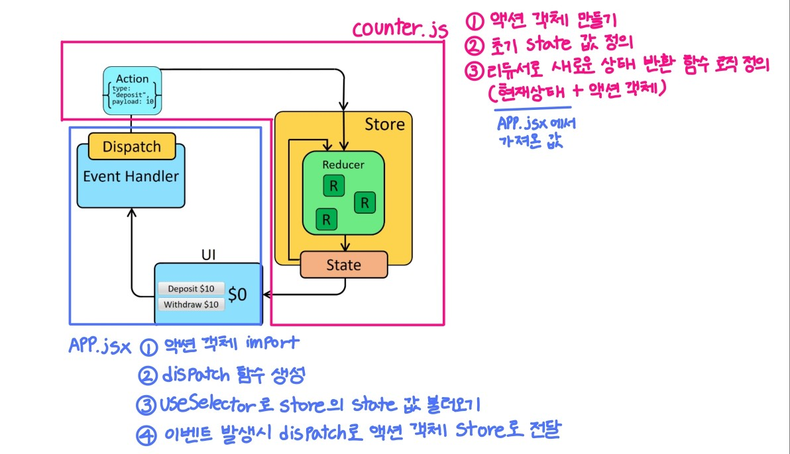

<br>

# 1. Redux 개요

## 1.1 Redux 정의

> 리덕스는 **전역상태 관리 라이브러리**이다.

- 중앙 State 관리소를 가지고 있으며, 모든 State는 이곳에서 생성된다.
- useState로 생성한 State는 Local State이고, 리덕스에서 생성한 State는 Global State이다.

<br>

> 리덕스는 useState와 Context API를 통해 발생할 수 있는 아래와 같은 상태 관리의 불편함을 일부 해소시켜준다.

- ① Prop Drilling 문제: 컴포넌트 트리의 여러 단계에 걸쳐 상태를 전달해야 하는 번거로움을 덜어준다. 리덕스는 중앙 저장소에서 상태를 관리하여, 어떤 컴포넌트에서도 상태를 직접 접근할 수 있게 해준다.
- ② Context API의 성능 문제: Context API는 상태가 변경될 때 이를 구독하는 모든 컴포넌트가 리렌더링되기 때문에 성능 저하가 발생할 수 있다. 리덕스는 상태 변경 시 해당 상태와 관련된 컴포넌트만 업데이트되도록 최적화된 상태 관리 방식을 제공하여, 성능 문제를 어느 정도 해결할 수 있다.
- ③ 상태 일관성 유지: Context API는 여러 상태를 함께 관리하는 데 불편함이 있을 수 있다. Redux는 중앙 집중식으로 상태를 관리하여 상태의 일관성을 유지하고, 상태 변경을 추적하게 쉽게 한다.

<br>

## 1.2 Global state와 Local state

- Local state (지역상태) ? 컴포넌트에서 useState를 이용해서 생성한 state
- Global state (전역상태)? 중앙 state 관리소(Store)에서 생성되는 state
  <br><br>
  

<br><br>

# 2. Redux 설정

## 2.1 Redux 설치

> 리액트에서 리덕스를 사용하기 위해서는 2개의 패키지를 설치해야한다.

```shell
yarn add redux react-redux

# 아래와 같은 의미
yarn add redux
yarn add react-redux
```

react-redux 라는 패키지는 리덕스를 리액트에서 사용할 수 있도록 서로 연결시켜주는 패키지이다.

<br>

## 2.2 폴더 구조 생성

1. `src` 폴더 안에 `redux` 폴더를 생성
2. `redux` 폴더 안에 `config`, `modules` 폴더를 생성
3. `config` 폴더 안에 `configStore.js`파일을 생성<br><br>
   

<br>

> 폴더 및 파일의 역할

| 디렉토리/파일 | 설명                                                                                                                                                                                                                                                                                                            |
| ------------- | --------------------------------------------------------------------------------------------------------------------------------------------------------------------------------------------------------------------------------------------------------------------------------------------------------------- |
| redux         | 리덕스와 관련된 코드 모음                                                                                                                                                                                                                                                                                       |
| config        | 리덕스 설정 파일 모음                                                                                                                                                                                                                                                                                           |
| configStore   | 중앙 state 관리소(Store) 설정 코드                                                                                                                                                                                                                                                                              |
| modules       | - 리덕스 상태 관리와 관련된 코드(액션 타입, 액션 크리에이터, 리듀서 등)를 하나의 파일이나 코드 블록으로 묶어 둔 것<br> - 즉, 우리가 만들 state들의 그룹<br>- ex) 투두리스트를 만든다고 한다면, 투두리스트에 필요한 state들이 모두 모여있을 todos.js를 생성하게 될텐데 이 todos.js 파일이 곧 하나의 모듈이 된다. |

<br>

## 2.3 설정 코드 작성

⚠️ 설정코드는 깊이 이해할 필요가 없다!

> src/configStore.js

src/configStore.js 에 아래 코드를 입력하자

```jsx
// 중앙 데이터 관리소(store)를 설정하는 부분
import { createStore } from "redux";
import { combineReducers } from "redux";

const rootReducer = combineReducers({});
const store = createStore(rootReducer);

export default store;
```

| 메소드              | 설명                                                                                                                                                                                                                          |
| ------------------- | ----------------------------------------------------------------------------------------------------------------------------------------------------------------------------------------------------------------------------- |
| `createStore()`     | 리덕스의 가장 핵심이 되는 스토어를 만드는 메소드로, 한 번만 호출된다.                                                                                                                                                         |
| `combineReducers()` | ① 리덕스는 action —> dispatch —> reducer 순으로 동작한다.<br> ② 이때 애플리케이션이 복잡해지게 되면 reducer 부분을 여러 개로 나눠야 하는 경우가 발생한다.<br> ③ combineReducers은 여러 리듀서를 하나의 state 객체로 합쳐준다. |

<br>

> index.js

```jsx
// 원래부터 있던 코드
import React from "react";
import ReactDOM from "react-dom/client";
import App from "./App";
import reportWebVitals from "./reportWebVitals";

// 추가할 코드
import store from "./redux/config/configStore";
import { Provider } from "react-redux";

const root = ReactDOM.createRoot(document.getElementById("root"));
root.render(
  //App을 Provider로 감싸주고, configStore에서 export default 한 store를 넣어주면 된다.
  <Provider store={store}>
    <App />
  </Provider>
);

// If you want to start measuring performance in your app, pass a function
// to log results (for example: reportWebVitals(console.log))
// or send to an analytics endpoint. Learn more: https://bit.ly/CRA-vitals
reportWebVitals();
```

<br><br>

# 3. Redux의 데이터 흐름


1. UI(컴포넌트)에서 이벤트가 발생시(ex. onClick) Dispatch가 <span style="color:indianred">액션 객체(type, payload)</span>를 스토어에게 전달한다. (Dispatch는 액션 객체를 가지고 스토어에게 던져주는 느낌⭐)
2. Store는 State와 Reducer를 포함한다.
3. 스토어의 Reducer는 Swich문을 통해 action의 type에 따라 state를 변경한다.<br>
4. 상태가 변경되면, 구독 중인 컴포넌트가 리렌더링된다.

<br>

> Redux를 이해하기 위한 핵심 개념

| 개념                   | 설명                                                                                                                                                                  | 예시                                                       |
| ---------------------- | --------------------------------------------------------------------------------------------------------------------------------------------------------------------- | ---------------------------------------------------------- |
| **컴포넌트(뷰)**       | 사용자 인터페이스를 렌더링하고, 사용자가 동작을 하면 `dispatch` 메서드를 호출하여 액션을 보낸다.                                                                      | 버튼 클릭 시 `dispatch({ type: 'INCREMENT', payload: 1 })` |
| **액션(Action)**       | 액션은 어떤 일이 일어났는지를 설명하는 객체이다. 보통 `type` 속성과 추가 데이터(`payload`)를 포함한다.                                                                | `{ type: 'INCREMENT', payload: 1 }`                        |
| **디스패치(Dispatch)** | 액션을 스토어로 전달하는 메서드이다. 컴포넌트에서 액션을 `dispatch` 하면, 그 액션이 Redux 스토어로 전달된다.                                                          | `dispatch({ type: 'INCREMENT', payload: 1 })`              |
| **리듀서(Reducer)**    | 현재 상태와 액션을 받아서 새로운 상태를 반환하는 순수 함수이다. 상태를 직접 변경하지 않고, 새로운 상태 객체를 반환한다.                                               | `(state, action) => newState`                              |
| **스토어(Store)**      | 스토어는 애플리케이션의 상태를 보관하는 객체이다. `createStore` 함수를 통해 생성된다. 스토어는 리듀서에 의해 상태가 업데이트되면, 모든 구독자에게 변경 사항을 알린다. | -                                                          |
| **구독(Subscription)** | 컴포넌트는 `useSelector` 훅을 사용하여 스토어의 상태를 구독한다. 상태가 변경되면 구독 중인 컴포넌트는 새로운 상태를 받아서 리렌더링된다.                              | -                                                          |

<br>

> 내가 그려본 redux 데이터 흐름


<br><br>

# 4. 모듈

## 4.1 모듈 만들기

> 카운터 프로그램에 필요한 State들이 모여있는 모듈(state의 그룹)을 만들어보자.

1. modules 폴더에 counter.js 파일을 생성
2. 코드 작성

   ```js
   // src/redux/modules/counter.js

   // (1) 초기 상태값
   const initialState = {
     number: 0,
   };

   // (2) 리듀서(state에 변화를 일으키는 "함수")
   // 즉, state를 action의 type에 따라 변경하는 함수
   // input: state와 action
   const counter = (state = initialState, action) => {
     switch (action.type) {
       default:
         return state;
     }
   };

   // 모듈파일에서는 리듀서를 export default 한다.
   export default counter;
   ```

<br>

> (1) initialState === 초기 상태값

useState를 사용했을 때 괄호 안에 초기값을 지정해주던 것과 같다.

```js
// useState() 사용

const [number, setNumber] = useState(0); // < 초기값 지정
```

<br>

> (2) Reducer

useState()를 사용할 때, number라는 값을 바꾸고 싶으면 아래 코드처럼 setNumber를 사용하여 값을 변경할 수 있었다.

리덕스에서는 리듀서가 이 역할을 한다.

```js
// useState() 사용

const onClickHandler = () => {
  setNumber(number + 1); // setState를 이용해서 state 변경
};
```

리듀서의 인자에 보면 `(state = intialState, action)` 이라고 되어있다.

1. `state = intialState` 처럼 state에 initialState를 할당해줘야한다.
2. 리듀서 인자 첫번째 자리에서는 state를, 두번째 자리에서는 action 이라는 것을 꺼내서 사용할 수 있다.

<br>


](../../../../assets/images/2024/Reducer.png)

<br>

## 4.2 모듈과 스토어 연결하기

> modules/couter.js에서 만든 리듀서를 rootReducer 안에 넣어주면 된다.

```jsx
// src/redux/config/configStore.js
import { createStore } from "redux";
import { combineReducers } from "redux";
import counter from "../modules/counter"; // (1) counter reducer import

const rootReducer = combineReducers({
  // (2) reduce 넣어 사용하기
  counter,
});
const store = createStore(rootReducer);

export default store;
```


<br>

> 생성한 모듈이 스토어에 잘 연결됐는지 확인해보자!

컴포넌트에서 redux store를 조회하고싶을 때 `useSelector`라는 react-redux 훅을 사용하면 된다.⭐

```js
// src/App.jsx
import { useSelector } from "react-redux"; // import

const App = () => {
  // useSelector로 store의 state 값을 불러올 수 있다.
  const counterStore = useSelector((state) => state); // 추가
  console.log(counterStore); // 스토어 조회

  return <div></div>;
};

export default App;
```

브라우저를 켜고, 콘솔을 보면 아래 이미지처럼 객체가 보이고, 그 안에 counter 라는 값이 있는 것을 볼 수 있다.

즉, 화살표 함수에서 꺼낸 state의 인자는 현재 프로젝트에 존재하는 <span style="color:indianred">모든 리덕스 모듈의 state</span>이다.


<br>

이제 number라는 값을 사용하고자 한다면 어떤 컴포넌트에서던지 아래 코드처럼 꺼내서 사용하면 된다.

```js
function App() {
  const date = useSelector((state) => {
    return state.counter;
  });
  console.log("counter:", date.number); // 0

  return <div>{date}</div>;
}
```

아래와 같이 사용할 수도 있다.

```js
function App() {
  const date = useSelector((state) => state.counter.number);
  console.log("counter:", date); // 0

  return <div>{date}</div>;
}
```


<br>

즉, 원래는 컴포넌트 내에서 state를 만들었기 때문에 그냥 state에 접근하면 됐지만, redux 사용시 중앙 저장소 store에 state(counter)가 존재하므로 store에 접근하는 로직이 필요하여 위와 같은 로직이 필요한 것이다.


> 정리

- ⭐⭐ 컴포넌트에서 리덕스 스토어를 조회하고자 할 때는 <span style="color:indianred">useSelector라는 ‘react-redux’의 훅을 사용</span>해야 한다.
- useSelector는 리덕스 스토어의 상태(state)를 조회한다.
- 리덕스는 상태 관리 라이브러리로서 중앙 집중식 상태를 관리하는데, useSelector를 사용하면 리액트 컴포넌트에서 리덕스 스토어에 저장된 상태를 가져와 컴포넌트에서 사용할 수 있게 해주는 역할을 한다.
- useSelector의 인자로 전달되는 콜백 함수는 현재 리덕스 스토어의 전체 상태를 받아오며, 여기서 필요한 부분만 선택하여 반환한다. 즉, 이 콜백 함수는 전체 스토어 상태에서 필요한 부분만 추출하는데 사용된다.

<br><br>

# 5. state 수정 기능 만들기

counter.js 모듈의 state 수정 기능을 만들어보자. (카운터 기능 구현)

## 5.1 state의 값을 변경하는 방법

> 어떻게 counter.js 모듈에 있는 state의 값을 변경할 수 있을까?

- useState()가 아닌 리덕스를 사용했을 때는 액션객체를 만들어 스토어에게 전달하는 과정을 거쳐야한다. 리덕스에서 값의 수정은 스토어의 리듀서에서 일어나기 때문이다.
- 리듀서란, 디스패치를 통해 전달받은 액션객체를 검사하고, 조건이 일치했을 때 새로운 상태값을 만들어내는 "변화를 만들어내는" 함수이다.

  1. 스토어에있는 리듀서에게 보낼 액션객체를 만든다. (액션객체는 반드시 type이라는 `key`를 가져야 한다.)
  2. 디스패치를 사용해서 액션객체를 리듀서로 보낸다.(디스패치를 사용하기위해 `useDispatch()` 라는 훅을 사용해야한다. )
  3. 리듀서에서 명령을 받아 number +1을 한다.

<br>



위 그림처럼 Reducer + Action 파일을 분리하지 않고 같이 두었다.<br>
이를 모듈이라 부를 것이다. 코드를 통해 자세히 살펴보자.

<br>

## 5.2 액션과 리듀서 설정

다양한 state 변경에 대한 action을 미리 정의해두자



```jsx
// src/redux/modules/counter.js

// 액션객체 type의 value를 상수들로 만들어 준다. (상수로 만드는 이유: 휴먼에러 방지)
// 액션객체 type의 value는 대문자로 작성한다.
const PLUS_ONE = "PLUS_ONE";
const MINUS_ONE = "MINUS_ONE";

// Action Creator 생성 (액션객체를 만드는 함수)
// Action Creator는 모듈 파일안에서 생성
export const plusOne = () => {
  return {
    type: PLUS_ONE,
  };
};
export const minusOne = () => {
  return {
    type: MINUS_ONE,
  };
};

// 초기 상태값
const initialState = {
  number: 0,
};

// 리듀서(현재상태 + 액션객체(type, payload) => 새로운 상태 반환하는 "함수")
const counter = (state = initialState, action) => {
  //  switch 문을 사용하여 액션의 타입에 따라 다른 로직을 수행하고 상태를 업데이트
  switch (action.type) {
    case PLUS_ONE: // case에서도 문자열이 아닌, 위에서 선언한 상수를 넣어준다.
      return {
        ...state, // 다른 상태값을 유지하기 위해 현재 상태를 복사한다.
        number: state.number + 1,
      };

    case MINUS_ONE:
      return {
        ...state,
        number: state.number - 1,
      };

    default:
      return state;
  }
};

// 모듈파일에서는 리듀서를 export default 한다.
export default counter;
```



<br>

## 5.3 UI와 이벤트 핸들러 설정



```jsx
// src/App.jsx

// 사용할 Action creator를 import
import { minusOne, plusOne } from "./redux/modules/counter";

import { useDispatch, useSelector } from "react-redux";

const App = () => {
  // useDispatch를 통해 store부터 dispatch 함수를 가져온다
  const dispatch = useDispatch();
  // useSelector로 store의 state 값을 불러올 수 있다.
  const data = useSelector((state) => state.counter);
  return (
    <div>
      <p>현재 카운트: {data.number}</p>
      {/* dispatch 함수는 액션을 파라미터로 전달한다. */}
      <button onClick={() => dispatch(plusOne())}>+1</button>
      <button onClick={() => dispatch(minusOne())}>-1</button>
    </div>
  );
};

export default App;
```



<br>

잘 작동한다!


<br>

# 6. Payload 개요

## 6.1 Payload 개념

> Payload는 액션 객체에 담겨 상태를 업데이트할 추가 정보를 제공하는 데이터이다.

- 즉, `“N을 더해”` 라고 N을 같이 리듀서에서 보내는 것이다.
- 지금까지는 ~을 이라는 목적어가 없었다면, 이제는 그 목적어가 생긴것이고 목적어도 액션객체에 담아 같이 보내줘야 할 것이다.
- 이렇게 액션객체에 같이 담아 보내주는 전달되는 실체를 payload라고 한다. 만약 `10을 더해` 라는 것을 리듀서에게 보내고 싶으면 액션객체에 payload를 같이 담아주는 것 이다.

<br>

```jsx
// payload가 추가된 액션객체

{type: "ADD_NUMBER", payload: 10} // type뿐만 아니라 payload라는 key와 value를 같이 담는다.
```

action 객체라는 것은 action type을 payload 만큼 처리하는 것이다. ex) payload가 3이면 3만큼을 plus

<br>

## 6.2 Payload 이용해서 기능 구현하기

- 위에서 만든 counter를 더 발전시켜서 +1, -1로 정해진 기능이 아니라 사용자가 직접 증감할 숫자를 정할 수 있게 만들어보자.
- input에 5를 입력해서 버튼을 누르면 5가 더해지는 형태의 APP을 만들고 싶으면 Payload를 사용하면 된다.

### 6.2.1 액션과 리듀서 설정

> src/redux/modules/counter.js

```js
// Action Types
const PLUS_ONE = "PLUS_ONE";
const MINUS_ONE = "MINUS_ONE";

// Action Creators
export const plusOne = () => ({ type: PLUS_ONE });
export const minusOne = () => ({ type: MINUS_ONE });

// Initial State
const initialState = { number: 0 };

// Reducer
const counter = (state = initialState, action) => {
  switch (action.type) {
    case PLUS_ONE:
      // state.number (기존의 nubmer)에 action.paylaod(유저가 더하길 원하는 값)을 더한다.
      return { ...state, number: state.number + 1 };
    case MINUS_ONE:
      return { ...state, number: state.number - 1 };
    default:
      return state;
  }
};

export default counter;
```

<br>

### 6.2.2 UI와 이벤트 핸들러 설정

```jsx
import React from "react";
import { useDispatch, useSelector } from "react-redux";
import { plusOne, minusOne } from "./redux/modules/counter";

const App = () => {
  // dispatch를 사용하기 위해 선언
  const dispatch = useDispatch();
  const counter = useSelector((state) => state.counter);

  return (
    <>
      <div>현재 카운트: {counter.number}</div>
      <button onClick={() => dispatch(plusOne())}>+ 1</button>
      <button onClick={() => dispatch(minusOne())}>- 1</button>
    </>
  );
};

export default App;
```

- 사용자가 컴포넌트에서 Action Creator로 payload를 담아 보내는 것은 액션객체에 담겨지고, 그렇게 담겨진 것은 리듀서에서 action.payload에서 꺼내 사용할 수 있다.
- 그래서 그것을 이용해서 기존의 값에 더해줌으로써 기능을 구현하는 것이다.

<br>

### 6.2.3 구현된 기능 테스트 하기

UI 및 counter 모듈을 모두 구현했으므로 잘 작동하는지 테스트를 해보자

먼저 App.js에서 useSelector를 이용해서 Store의 값을 조회하고 화면상에 렌더링하는 기능을 추가해보자

```jsx
// src/App.js
import { useState } from "react";
import { useDispatch, useSelector } from "react-redux";

import { addNumber } from "./redux/modules/counter";

const App = () => {
  // dispatch를 사용하기 위해 선언
  const dispatch = useDispatch();
  const [number, setNumber] = useState(0);
  const globalNumber = useSelector((state) => state.counter.number);

  const onChangeHandler = (event) => {
    const { value } = event.target;
    setNumber(+value);
  };

  const onClickAddNumberHandler = () => {
    // Action creator를 dispatch 해주고, 그때 Action creator의 인자에 number를 넣기.
    dispatch(addNumber(number));
  };

  return (
    <div>
      <div>{globalNumber}</div>
      <input type="number" onChange={onChangeHandler} />
      <button onClick={onClickAddNumberHandler}>더하기</button>
      <button>빼기</button>
    </div>
  );
};

export default App;
```

<br>

잘 작동하는 것을 볼 수 있다!


<br><br>

# 7. Ducks 패턴

> Erik Rasmussen 이 제안한 Ducks 패턴은 아래의 내용을 지켜 모듈을 작성하는 것이다.

위에서 작성한 코드들이 Ducks 패턴이다. 자세히 살펴보자.

1. Reducer 함수를 `export default` 한다.
2. Action creator 함수들을 `export` 한다.
3. Action type은 `app/reducer/ACTION_TYPE` 형태로 작성한다.

(외부 라이브러리로서 사용될 경우 또는 외부 라이브러리가 필요로 할 경우에는 UPPER_SNAKE_CASE 로만 작성해도 괜찮다.)

그래서 모듈 파일 1개에 `Action Type`, `Action Creator`, `Reducer` 가 모두 존재하는 작성방식인 것이다.

<br><br>

# 8. Redux DevTools 사용

> 리덕스 상태를 디버깅하기 위한 브라우저 확장 프로그램인 "Redux DevTools"를 설치하면, 상태 변화를 쉽게 추적할 수 있다.

<br>
